# Trees {#tree}

## Balanced Trees

A tree is balanced when each level of the tree (except possibly the last
level) has as many nodes as it can hold. . More formally a binary tree
is balanced if, for every node in the tree, the number of inner nodes of
the left and right subtrees differs by at most 1.

Another way to define a balanced tree is to think about the depth of the
leaf nodes. A binary tree is balanced if the difference in depth of any
two leaf nodes is at most one. The tree below is balanced because all of
the nodes have left and right subtrees with the same number of nodes
except for left most bottom subtree which has a node-difference of 1
between its left and right subtrees.

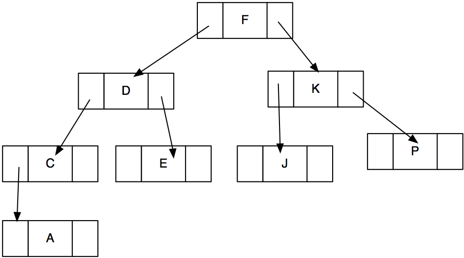

Because sorted trees can be very sensitive to input order, they can
quickly become unbalanced. For example, try to sketch the binary tree
that results from adding the following nodes (in the order given): A C D
E F J K P

An unbalanced tree does not have O(log N) speed for operations and could
be as poor as O(N) if the tree becomes a linked list due to input order.
It is desirable to keep binary trees balanced.

A tree can be rebalanced , but the rebalancing operation must not
violate the sorting rule for the the nodes in the tree and it must be
more efficient than simply rebuilding the tree by randomizing the input
order. The operation used to rebalance a tree is called a **rotation**.
The exact algorithm for performing rotations depends on the type of
tree.

The figure below shows an unbalanced tree of three nodes. The sort-order
of the tree is that larger elements are placed in the right subtree. The
tree is unbalanced to the right. We can determine this because the
height of the right subtree is 2 but the height of the left subtree is
0. The right subtree is more than one higher than the left subtree. This
tree can be rebalanced by rotating the right subtree to the right, which
causes the middle node to become the new root node. The rotation does
not violate the sort-order rule for this tree, but this particular
rotation operation can only work if the middle node (the one that will
be the new root) has no left tree.

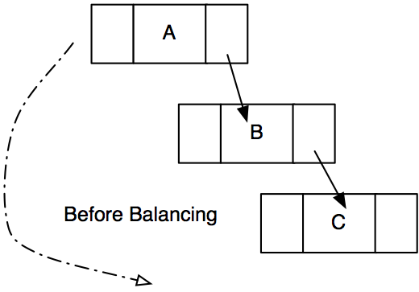

After the rotation the tree will have B as the root node and will have
two subtrees of height 1, leaving the tree in a balanced state.

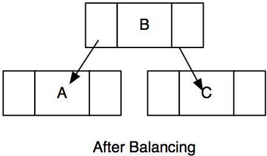

A similar subtree tree that is unbalanced to the left can be rebalanced
using a rotation to the right. The tree shown below is unbalanced
because the left subtree has a height of two and the right subtree has a
height of zero.

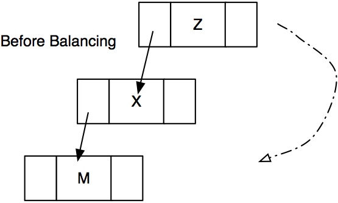 This type of right rotation is only
possible if the middle node has no right subtree. After the rotation,
the tree looks like this:

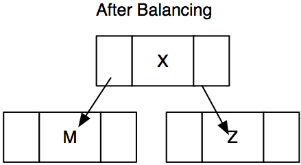

Sequences of left and right rotations using subtrees of an unbalanced
tree can be used to rebalanced the tree. In the next few sections we
will explore the use of rotations to balance binary search trees.

## Binary Search Trees

One common application for binary trees is to use them as a search tree
for quickly finding stored information. Binary trees are fast, as long
as they are balanced. Unfortunately, in the worst case scenario (if the
data is entered sorted, for example), a binary search tree has O(N)
complexity for insertion and retrieval. (Can you explain why this the
case?)

To mitigate the problems associated with the order of insertions,
specialized binary search trees have been developed that maintain the
balance of the tree as data is entered and removed. There are many types
of search trees including AVL trees, B trees, 2-3 trees, Red-black
trees, Splay trees, and skip lists. We will examine two such trees, AVL
trees and B trees.

### AVL trees

The AVL tree was proposed in 1962 as a solution to the problems with
binary search trees. It is named in honour of the authors of the
original paper introducing the tree, Adel'son-Velskii and Landis.

An AVL tree maintains the balance of the binary tree by rearranging the
tree on insert and delete to carefully manage the height difference of
the children of every node.

For example, in the three shown below 5 has just been inserted into the
tree. The left subtree of node 82 has height of 2 and the right subtree
of node 82 has height of 0. The height difference between the two
subtrees of node 82 is greater than one, which indicates that the tree
must be rebalanced.

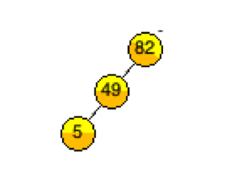{#fig:tree1}

A **right rotation** is performed on the **left child** of the
unbalanced node, leaving a rebalanced tree. Notice that the root node of
the tree has changed (it is now node 49) but the tree still meets the
sorting rule for this binary tree.

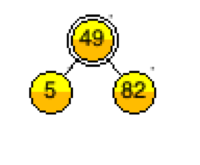{#fig:tree2}

Node 74 is then added to the tree. After insertion the right subtree of
node 49 has a height of two and the left subtree has a height of one.
The difference between the two subtrees of the root node (49) is 1,
which indicates that the tree does not need to be rebalanced.

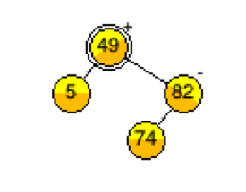{#fig:tree3}

After inserting both 41 and 38 the tree is again unbalanced. While the
height difference between the subtrees of node 49 is only one, the
balancing algorithm must check the height differences of all subtrees as
well. The left subtree of node 5 has a height of zero and the right
subtree of node 5 has a height of two, which indicates a need to
rebalance that subtree tree.

{#fig:tree4}

We cannot rebalance this tree with a simple rotation because the
imbalance is not all with right or left children. 41 is a right child of
5 but 38 is a left child of 41. This tree must be rebalanced in two
steps. Intuititvely we know that we must end up with 38 as the root and
make node 5 a child of node 38. The process is to do an initial rotation
to create a subtree of all right (or all left) children, and then do the
appropriate rotation on that intermediate subtree to balance. The first
step in accomplishing this is to do a right rotation with node 5's right
child (41) which switches the places of nodes 38 and 41. 41 has one
child (38) and no left child. If we do a right rotation on 41, 38
becomes the root of the subtree, 41 becomes its child.

Nodes 5, 38, and 41 are now in order (and all in right subtrees), but
the tree is still unbalanced.

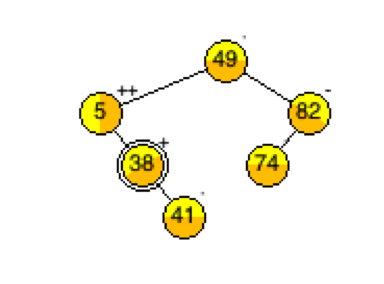{#fig:tree5}

The second step is to do a left rotation with node 5, which rotates node
38 into the parent position. This is the same left rotation that was
illustrated at the beginning of this section. It simply turns the middle
node in the 3-node subtree into the root node, making the old root node
the left child.

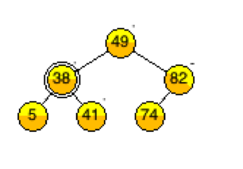{#fig:tree6}

After adding 21, then 25 to this tree, node 5 is unbalanced. We must
rebalance that subtree.

{#fig:tree7}

The subtree can be rebalanced by doing a left rotation on the subtree.
Because the subtree is already in a straight line, a single left
rotation will rebalance it, leaving 21 as the root of the subtree with 5
and 25 as its children.

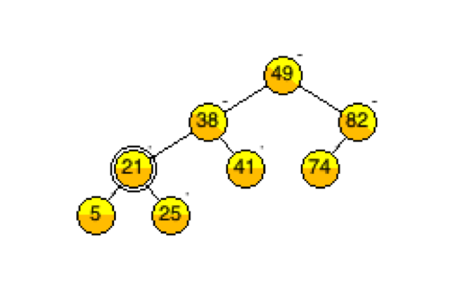{#fig:tree8}

If 35 is added to this tree, node 21 is balanced, but node 38 is out of
balance.

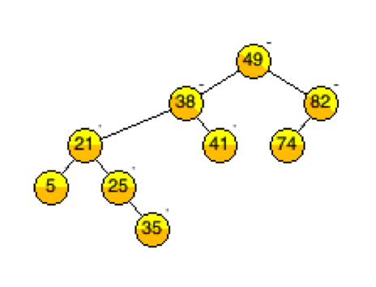{#fig:tree9}

Two rotations are required to rebalance the resulting tree. First the
left subtree of node 38 must be rotated left and then the entire subtree
tree rooted at 38 must be rotated right, leaving 25 as the root node of
the subtree. 35 becomes the child of 38, and 38 becomes the child of 25.
There is often a need for more than one rotation to maintain balance of
an AVL tree.

{#fig:tree11}

The same rotation rules apply when deleting nodes from the tree. While
the rotations can seem complicated, the AVL tree is actually fairly
simple once you understand the patterns for selecting the rotations.

#### Nodes for AVL trees

To facilitate the balancing of the trees, each node in an AVL tree
contains an additional member that is the height of the subtree rooted
at that node. Some algorithms for AVL trees count a tree of one node as
height 1 rather than height 0. This reference material uses height 1 as
the height for The height attribute of each node is used to compute
whether or not the tree is balanced.

{#fig:tree12}

A balanced AVL tree has no subtrees for which differences in height
between left and right children is more than 1.

Consider the example below: The root node in the first tree has a height
of 2 because it has a left child. The child has a height of 1. The
height of a node is its distance from the furthest leaf node + 1, for
the purposes of the algorithms given here for balancing an AVL tree.

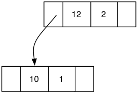{#fig:tree13}

The next example shows a tree of height 3, with the heights of the
children shown as well. Notice that the root node has two children, one
with a height of 2 and one with a height of 1. Because the difference in
heights of these two children is 1, the tree is still a balanced AVL
tree.

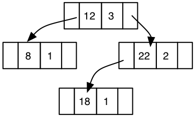{#fig:tree14}

While the examples in the picture show an AVL tree storing integers, it
is far more useful to have an AVL tree that is abstracted to store any
type of data. One possible design for the c structures for an AVL tree
is shown below. Notice that the AVLTree is separate from the
AVLTreeNodes. This permits the use of function pointers to compare and
destroy the void data types without any requirement that the tree
library has knowledge of what those data types are.

    struct  AVLTreeNode{
        void * data;
        int nodeBalance;
        struct AVLTreeNode * left;
        struct AVLTreeNode * right;
    };

    struct AVLTree {
        struct AVLTreeNode * root;
        int (*compare) (void * data1, void * data2);
        void (* destroy) (void * data);
    };

#### AVL Tree Operations

The interface/function requirements for an AVL tree are the same as
those of any binary tree. The user of the AVL tree library will need at
least the following functionality.

    Tree * createAVLTree(int (*comparePointer) (void * data1, void * data2), void (*destroyPointer) (void *));
    void  destroyAVLTree(Tree * toDie);
    void addToTree(Tree * theTree, void * data);
    void removeFromTree(Tree * theTree, void * data);
    bool isInTree(Tree * theTree, void * data);

Additionally, the tree ADT will be more useful with the inclusion of
pre/post and in order iterators. A simple way to implement iterator
functionality is to permit only one iterator at a time on any given tree
and to require a flag as a parameter to the iterator function to
indicate the desired traversal. The functions required for such an
iterator include a function to initialize the iterator and one to get
the next value from the iterator.

    //Iterator functions
    void  initializeIterator(Tree * theTree, int traversalType);
    void * interatorNext(Tree *theTree);

Finally, the user of the tree ADT might appreciate some utility
functions to help with writing specialized operations for the tree.
These might include functions for determining if the tree is empty and
functions for examining subtrees of the tree.

    bool isTreeEmpty(Tree * theTree);
    Tree * getLeftSubtree (Tree *);
    Tree * getRightSubtree (Tree *);
    void * getRootData(Tree *);
    \end{verbatim}

    The functions listed above comprise the programming interface that a \textbf{user} of the ADT would interact with. The AVL tree needs several functions that are used only by the internal operations of the tree itself. In particular, all of the programming interface functions have a parallel internal function that operates recursively on the nodes of the tree. Those functions are joined by the functions to perform the required rotations to keep the tree balanced. In the prototypes below COMPAREPTR and DESTROYPTR are the function pointers to the compare and destroy functions.

    \begin{lstlisting}
    //Internal functions used by Tree ADT but not exposed to user of library
    TreeNode * insert(TreeNode * root, void * data, COMPAREPTR);
    TreeNode * delete(TreeNode * root, void * data,COMPAREPTR, DESTROYPTR);
    TreeNode * find(TreeNode * root, void * data, COMPAREPTR);
    TreeNode * findMin(TreeNode *);
    TreeNode * findMax(TreeNode *);
    bool isEmpty(TreeNode * root);
    void destroy(TreeNode * root,DESTROYPTR);

#### Algorithms for Balancing AVL Trees

Most AVL tree functions are nearly identical to the functions found in a
Binary Tree ADT with the exception of the insert and delete functions.
Insert and delete have an additional balancing step that is invoked to
ensure that the AVL tree remains in a balanced state after each
insertion and deletion. An AVL tree is said to be balanced when the
height difference between left and right subtrees is either 0 or 1 for
every node in the tree.

Some AVL tree implementations keep track of the height of a node (from
leaf to current node, starting counting at 1), some implementations keep
track of the positive or negative balance factor for each node. The
algorithms presented here keeps track of the heights of nodes and
calculates the balance factor as needed.

When a tree becomes unbalanced, there are four possible situations:

-   a\) the imbalance occurs in right subtrees

-   b\) the imbalance occurs in left subtrees

-   c\) the imbalance occurs in a right then left subtree

-   d\) the imbalance occurs in a left then right subtree

Each of the images below shows a three node tree that matches each of
the cases above. Notice that each root node has a height of 3, has a
single child that is height two, which means that the difference in
heights of the nodes right and left children is greater than one.

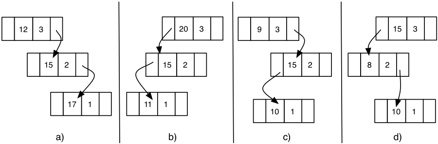{#fig:tree15}

The solution to such imbalances is to rotate the subtree to restore
balance. In all cases it is important to maintain the sorting rule for
the binary tree.

These cases hold even if the tree is a larger tree in which all nodes
have children. The children of the newly assigned root in rotated
subtrees are reassigned to the new children, maintaining the binary tree
sort.

Lets look at them case by case.

#### Case A: Imbalance to the right -$>$ Left Rotation.

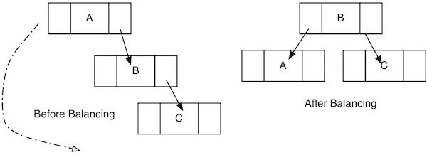{#fig:leftrotate width="50%"}

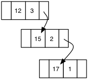{#fig:tree16}

Node 12 violates the AVL property because its right subtree has height
two and its left subtree has height zero.

In this case, we know that node 12's child (15) has a value that is
between node 12 and the grandchild (17). We know this because the tree
is a binary tree and these are all right children.

We can make 15 the new root of this subtree, make 12 its left child, and
restore balance to the tree.

This is called a **single rotation**. The resulting subtree is shown
below with the heights updated. Note that 15 is now of height 2 and 12
and 17 each have height of 1.

If 15 had a left child, it would become the right child of node 12 after
the rotation. This is always possible without affecting the sorted
property of the tree because node 12 initially had node 15 as the right
child initially, so all of node 15's children will have the same
sort-relationship with node 12.

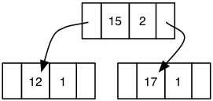{#fig:tree17}

### Case B: Imbalance to the left -$>$ Right rotation

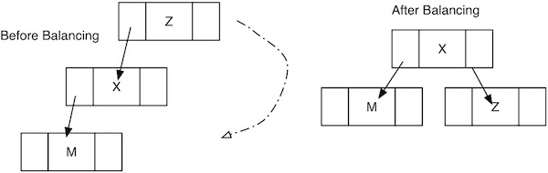{#fig:rightrotate
width="50%"}

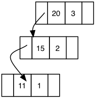{#fig:tree18}

-   This case is the mirror image of Case A.

-   Node 20 is violating the AVL property. We know that its left child
    has a value that is 'between' node 20 and its grandchild.

-   Node 15 becomes the new root, Node 20 becomes the right child and
    node 11 remains as the left child.

-   This is also a single rotation (to the right).

    -   Any right child of node 15 becomes the left child of node 20
        after the rotation.

### Case C: Imbalance in left subtree of right child -- double rotation

{#fig:tree19}

-   In this case, a single rotation will not fix the balance problem.
    The middle node (15) does not have the middle value, so we cannot
    simply rotate to make 15 the new root node.

-   Instead we perform two rotations. The first is a right rotation on
    the child of the imbalanced node. This rotation has the effect of
    turning the rotation into case A. We make node 10 a child of node 9
    and making node 15 a child of node 10, but we do not update the
    height values as this is an intermediate step.

    -   Any right child of node 10 becomes the left child of node 15

-   The second rotation is a left rotation on the imbalanced node, which
    will restore balance to the tree. We update the height values in the
    nodes after the second rotation.

    -   Any left child of node 10 becomes the right child of node 9

{#fig:tree20}

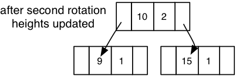{#fig:tree21}

**Case D: Imbalance due to right child of left subtree -$>$ double
rotation**

{#fig:tree22}

-   This case is a mirror image of Case 3. You begin by doing a left
    rotation on the left child of the imbalanced node.

    -   The left child of node 10 becomes the right child of node 8

-   The balancing is finished by doing a right rotation on the
    imbalanced node.

    -   The right child of node 10 becomes a left child of node 15

-   In this case the result is a tree rooted at 8.

#### AVL Tree Pseudocode

An AVL tree ADT needs to be able to find the height of the node, it
needs functions to rotateRight (with left child) and to rotateLeft (with
right child). The insert function for an AVL tree can be easily written
as a recursive function. An iterative function can be written to be
slightly more efficient, but is much harder to write and debug (and to
read).

The pseudocode is given for insert and for one set of rotation
algorithms. The remaining two rotation algorithms are mirror images of
the two given and are left as an exercise.

    insert(TreeNode * treeRoot, void * data): TreeNode *

      if treeRoot == NULL  create a new node with the data, return node
      else
        if the data to be inserted is less that the treeRoot data
          treeRoot->left = insert (treeRoot->left, data)  //recursive call
          //after insertion we must rebalance
          if (height of treeRoot left child is more than 1 bigger than height of treeRoot right child)
            if (data that was inserted is less than the left child)
              treeRoot = rotateRightWithLeftChild(treeRoot)  //case b
            else
              treeRoot=doubleRotateWithLeftChild(treeRoot) //case d
              
        else if the data is bigger than the treeRoot data
          treeRoot->right = insert(treeRoot->right, data) //recursive call
          //after insertion we must rebalance
          if (height of treeRoot right child is more than one taller than height of treeRoot left child)
            if (data is greater than element of right child)
              treeRoot = rotateLeftWithRightChild(treeRoot) //case a
            else
              treeRoot = doubleRotateWithRightChild(treeRoot) //case c
              
      treeRoot->height = max of child heights +1
      return treeRoot

Rotate right with left child is the function for the rotation noted in
case b earlier in the notes.

    //Case B
    rotateRightWithLeftChild(TreeNode * oldRoot): TreeNode *
      TreeNode * temp = oldRoot->left
      oldRoot->left = temp->right
      temp->right = oldRoot
      temp->height = max of children's heights +1
      oldRoot->height = max of children's heights +1
      return(temp)

    //case D
    doubleRotateWithLeftChild (TreeNode * oldRoot): TreeNode *
      oldRoot->left = rotateWithRightChild(oldRoot->left)
      oldRoot = rotateWithLeftChild(oldRoot)
      return(oldRoot)
        

Delete is somewhat more complicated for an AVL tree because of the need
to maintain both the balance of the tree and the sorting-rule for the
tree. Often a lazy delete is implemented where elements are simply
marked as deleted and not actually removed from the tree. When some
percentage of elements are marked as deleted a new tree is constructed
from the remaining elements and the old tree is deleted. This is an
effective strategy if elements are not deleted often.

The function names given in this section are not necessarily the same as
the function names you will be asked to use for the lab portion for this
section of the course.

## B-Trees

Suppose that you have so much data to manage that the resulting data
structure cannot be held in the memory of the computer. In this case,
the data structure and data must reside on persistent storage, usually
some kind of drive, either attached to the computer or accessed via a
network connection. It is far more expensive in terms of time and
complexity to read/write information on a disk than it is from computer
memory. This dramatically changes the cost of operations that must
traverse the search tree. One disk access takes at least 100 000 times
longer than a single operation in memory, so an ADT that stores data
persistently must be designed to minimize the number of disk accesses.

Even with a perfectly balanced AVL tree, the number of disk accesses to
access information will be O(log n). Suppose the data set in question
has one million entries, log~2~ of one million is approximately 20. If
we guess that a hard drive has a seek time of 15 milliseconds, the
optimistic time for a disk-based AVL tree is about 1/3 of a second per
operation. That is far too slow for any type of modern data management
system.

**B-Trees** are an ADT that generalize the binary tree to allow more
than two branches per node. The B-Tree is designed to reduce the number
of disk accesses to a small constant number. The algorithms for
operations are a bit more complicated than for other trees, but the
result is a search tree that minimizes disk accesses.

B-Trees are based on the idea of adding more branches to the tree,
creating an m-ary search tree rather than a binary search tree.

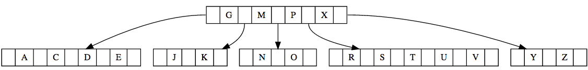{#fig:tree23 width="\\textwidth"}

The image above shows a small b-tree with a single root node and five
children. The nodes in a b-tree hold multiple data values (called keys)
and have one more child node than data. For example, the root node of
the example shown above has 4 keys (data elements) and 5 children. The
second child has 2 data elements and three child pointers, all currently
empty. Notice how each node in the b-tree holds more than one value. The
data element in a b-tree is called a**key**. As with other binary trees,
the data element must have a compare function that allows the elements
to be ordered.

The **degree** of a b-tree defines the minimum and maximum numbers of
keys and subtrees that any not can have. The example b-tree shown has a
degree of 3. Given the degree of a tree (lets call the degree 't'), we
can state the following characteristics of the b-tree:

-   Every node in the tree, with the exception of the root node, must
    contain at least t-1 keys. You can see in the example tree that none
    of the nodes contain fewer than 2 keys.

-   No node (including the root node) may contain more than 2t-1 keys.
    The example tree has no nodes with 5 keys, but the number of keys in
    a node changes when nodes are inserted and deleted. When the maximum
    number of keys is exceded, the tree must be rebalanced.

-   The number of children in a node is equal to the number of keys +1.
    A node with two keys has 3 children. A node with 4 keys has 5
    children.

-   Keys are sorted in increasing order within a node. The child tree
    between two nodes contains all the keys that fall between the values
    of the two parent keys. The values in a child node are always less
    than or equal to the parent key to the right of the child and are
    always more than the value of the parent key to the left of the
    child.

-   The height of a b-tree is approximately log~m~N where m is the
    maximum number of children that a node can have (2t).

The size of the nodes is managed by splitting and combining nodes during
insert and delete operations. The figure below shows the example B-tree
after adding W as a key to the tree.

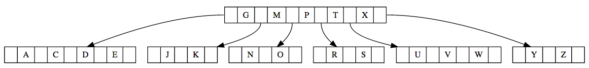{#fig:tree24
width="\\textwidth"}

By inserting W into the tree the node containing R,S,T and U becomes too
large and must be split. The middle value (T) is moved to the parent
node and the remaining keys are split into two nodes, R and S on the
left side of T and U,V, W on the right side of T.

All the leaf nodes of a B-tree are at the same height. The tree is
rebalanced after insertions and deletions to ensure that all leaf nodes
are at the same height. Our example B-tree is rebalanced to be of height
3 when after both B and F are added. The addition of B and F makes the
left-most child too long and it must be split. That split increases the
height of the leaf notes to 3, which necessitates rebalancing the entire
tree to be of height 3.

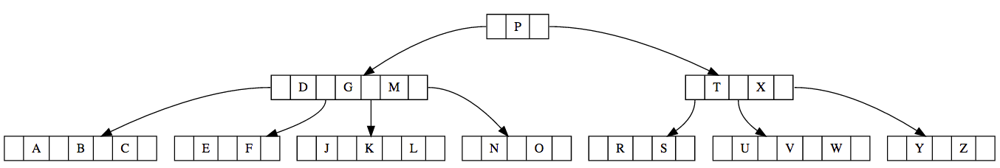{#fig:btree3
width="\\textwidth"}

If a key is deleted from a node, leaving too few children in the node, a
key is removed from a sibling to add to the too-empty node. This process
often involves adding a new key to the parent, and moving a key from the
parent into the too-empty child. Below is a figure showing the effect of
removing key N from the tree shown above. Because the removal of N
leaves its node too empty, L is moved to the parent node from a sibling
node, and O is move to the child node which balances the tree and
ensures that all nodes have the correct size.

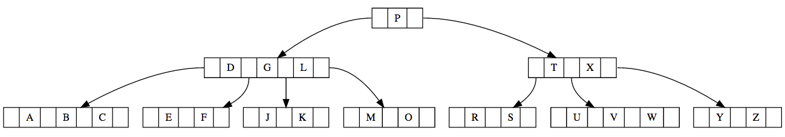{#fig:btree4
width="\\textwidth"}

The algorithms for insertion and removal into b-trees are
straightforward but there are many cases required to accommodate
resizing the nodes. The cases for insertion and deletion can be
summarized as follows:

-   Inserting a key into a node within the min/max parameters

    -   Key is simply inserted

-   Inserting a key into a node that is full

    -   Node is split into three (two children and a root)

    -   The root is given to the parent node

        -   May result in the parent node being split and keys being
            moved from it

-   Deleting a key from a leaf node that has at least 2 more than
    minimum

    -   Key is simply deleted

-   Deleting a key from a leaf node that has only 1 more than minimum

    -   Key is deleted

    -   If a sibling node has an extra key, a rotation is done to move
        the extra key to the parent and a parent's key to the underfull
        child

    -   If a sibling node does not have an extra key, nodes must be
        deleted and recombined

-   Deleting a key from an internal node

    -   Rotations must be performed to ensure that the keys in the
        internal node are greater than or equal to the keys in the
        appropriate subtree.

## Summary

After working through these materials you should be able to implement an
AVL tree using a lazy delete strategy. With a little bit of thinking you
should be able to identify an algorithm for a direct delete for an AVL
tree. You should understand what a binary search tree is, and you should
easily be able to read and understand any online resource about the
other types of binary search trees.

At this point in the course you should also be able to identify good
online resources and use them to teach yourself about any data
structure.

## Additional Resources

-   <http://ysangkok.github.io/js-clrs-btree/btree.html>

-   <http://www.csanimated.com/animation.php?t=B-tree>

-   <http://www.csanimated.com/animation.php?t=Self-balancing_binary_search_tree>

-   <http://www.bluerwhite.org/btree/>

## Extending Activities

-   Using the applet found
    at:<https://people.ksp.sk/~kuko/gnarley-trees/>, create a binary
    search tree (BST) by inserting the numbers between 1 and 9 into the
    tree, in order. What do you notice about the tree? (unclick the
    pause button once you understand what the insertion is doing)

    Clear the tree and insert the same numbers in the following order 5
    3 7 4 2 8 6 9 1 . What do you notice about the tree this time?

-   The tree shown in this figure is unbalanced.

    

    It needs a right rotation on node 38 to complete the balancing step.
    List the steps required to complete the rotation.

-    Write C code showing the struct you would implement for a fully
    abstracted btree. Write the c code for the insert function for the
    b-tree.

-   Investigate red-black trees to determine the key similarities and
    differences between red-black trees and AVL trees

-   What is the maximum height of an AVL tree with 9 nodes? A tree with
    one node is height 1. Can you find a formula for the maximum height
    of an AVL tree with N nodes?

-   Design an augmented AVL tree which can quickly compute the number of
    nodes in any tree or subtree. Discuss changes to the struct for the
    AVL tree as well as necessary changes to any of the algorithms for
    the ADT.
