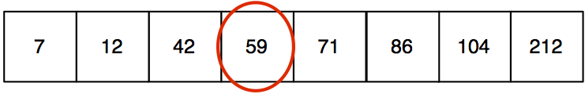
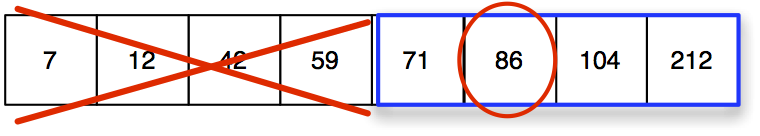
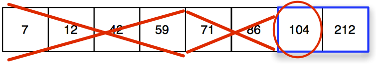
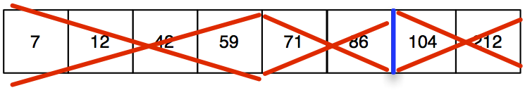

# Algorithmic Complexity and Complexity Analysis

The efficiency of an algorithm can be measured by estimating how long
the algorithm will take to complete for some set of data, and by
estimating how much memory the algorithm will require to perform that
execution. The context of your computing environment tells you which
measure is most important. If you have limited memory you will require
an algorithm that uses minimal memory. If you need an answer very
quickly, you will require an algorithm with fast execution time. The
estimate of the efficiency of an algorithm is known as the algorithm's
**complexity**.

### Determining Complexity

We often need to know the complexity of a particular algorithm. We could
attempt to experimentally determine the running time of an algorithm, or
we could analyse the algorithm theoretically.

#### Experimental Analysis

In order to experimentally analyse an algorithm, we first must implement
the algorithm. This seems like an obvious step, but if we're trying to
choose between three competing algorithms, the experimental analysis
means that all three algorithms must be implemented. Sometimes that is
trivial, sometimes it is not.

After the algorithm is implemented, we must **instrument** the algorithm
to enable us to measure the running time. Usually that means using some
kind of timer or clock. Below is a sample testing function that uses two
fictional functions, Sort() and Time(). Sort() is the function being
analysed. Time() is the function used to capture the time in seconds
since midnight.

    float testSort( List * the List)
    {
        float seconds = 0.0;
        float time1, time2;
        time1 = Time();
        Sort(theList);
        time2 = Time();
        seconds = time2-time1
        return seconds;
    }

The testSort function would be run with a variety of lists using
different sizes and compositions of data. The results would be analysed
statistically to determine the best, worst, and average running time of
the algorithm, and what data characteristics affect those times.

While this process sounds straightforward, there are several possible
issues that can make consistent analysis difficult. For example:

-   What language should be used for testing running time of the
    algorithm? Some languages might offer facilities that significantly
    slow down, or speed up some operations.

-   What compiler should be used? Some languages (like C) have different
    compilers available. Each compiler is slightly different and will
    result in different running times.

-   What hardware environment should be used? Will the results from
    running on a new hardware system be the same as running on a system
    that is several years old?

-   What software should be used? Will the results from running on a
    Windows operating system be the same as the results from running on
    a linux system?

-   How do we select the data to be input? If two different testers make
    test data, will the results be the same?

Clearly, it is much more difficult to get consistent measurements of
running time experimentally than it seems. Most often we content
ourselves with a theoretical analysis of the algorithm. This theoretical
analysis does not have to be formal (in the sense that it requires a
full blown proof).

#### Theoretical Analysis

Theoretical analysis of algorithms has the advantage that the running
time of the algorithm can be evaluated without having to implement the
algorithm, while taking into account all possible inputs, independently
of hardware and software.

We perform a theoretical analysis by counting the primitive operations
in an algorithm. Primitive operations include assignments, comparisons
and arithmetic operations. This counting exercise must take into
consideration the effect of the size of the input values. The size of
the input usually impacts things like the number of iterations of a loop
or the length of an array.

Consider the code(shown below) for finding the maximum value in a list
of integers. The code assumes that the List ADT has functions for
getting the value of an element at a specific place and for finding the
length of the list. We'll assume, for the purposes of this analysis, the
the running time for all the list operations used in the example is O(1)
or constant time.

    int findMax(List theList)
    {
        int currentMax = getFirstElement(theList);
        int i;
        for(i = 1; i<length(theList); i++)
        {
            tempElement = getElement(theList, i);
            if (tempElement > currentMax)
                currentMax = tempElement;
        }
        return currentMax;
    }

A count of the primitive operations in this code (where n = length of
the list) yields the following:

  int currentMax = getFirstElement(theList);   2 (assignment and list function call)
  -------------------------------------------- ---------------------------------------------------------------------
  int i = 0;                                   1 (assignment)
  for(i = 1; i\<length(theList); i++)          2(n-1)+1 (1 assignment plus n-1 comparions and n-1 increments of i)
  tempElement = getElement(theList, i);        2(n-1) (2 operations done n-1 times)
  if (tempElement \> currentMax)               n-1 (1 comparison done n-1 times)
  currentMax = tempElement;                    n-1 (1 comparison done n-1 times)
  return currentMax;                           1

This algorithm only runs through the entire list if the largest value in
the list is in the last position of the list. That is called the **worst
case**. In the worst case, the algorithm executes 5 + 6(n-1), or 6n -1
primitive statements (with the assumption that the list functions are
the equivalent of a primitive statement).

Lets suppose that there was one specific primitive operation that took
longer than the others, and one that was faster. Without doing an
analysis to determine exactly the speed of each primitive operation, we
can say that the fastest execution speed would occur if all the
primitive operations were the fastest operation. We can also say that
the slowest execution speed for this algorithm would occur if all the
primitive operations were the slowest operation. So the execution speed
of the function, is bounded by the fastest/slowest speeds of the
primitive operations.

For the purposes of estimating complexity of algorithms, we assume that
primitive operations take **constant time** and don't worry too much
about exactly how much time that is. Using that knowledge we can say
that the algorithm above takes 6n -1 constant time units based on the
worst case analysis.

This means that the execution time of the algorithm depends on the
length of the list (n). We say that such an algorithm is **Order N** or
**O(N)**.

### Big O notation

Time complexity is often expressed in Big O notation. The big O is read
as **on the order of**,which means that the most significant factor in
the time complexity analysis is shown. The **N** represents the data
input into the algorithm.

So if we say that an algorithm is O(N) (read that as order-N),we mean
that the upper bound on execution is controlled linearly by the number
of input data. We do NOT mean that the algorithm will take exactly N
time to complete.

Big O notation signifies an **upper bound** on the
complexity/computational time for an algorithm. The term upper bound
means that the algorithm might run faster, but won't run slower.

Big O notation usually describes worst case, but sometimes it is given
for average and best case too when that can be clearly defined. The
complexity measure describes a relationship between the size of the
input data (how much data goes in) and the time the algorithm will take
to run. Typical Big O values are O(1) or constant time, O(N) or
proportional to data size, and O(n^2^), which means that execution will
take approximately as long as the square of the size of data. We'll
learn about each of these types of algorithms as well as others during
the course of this class.

### Estimating Complexity

Imagine that you are estimating the number of days required for an
automobile trip across Canada. Your estimation would likely include the
distances between major cities, but you would be unlikely to factor in
the short side trips into small centers for gasoline, or trips into
museums or tourist sites. The most significant distances are the ones
between the cities so those become the basis for your overall estimate
of trip time.

When you are estimating time complexity of an algorithm, you also ignore
the \"side trips\", or the parts of the program that don't contribute
much to the overall execution time. When calculating computational
complexity we ignore things like the programming language used, the
characteristics of the compiler, and the speed of the computer that will
be used to run the program. The time complexity of the algorithm is
based on the characteristics of the algorithm alone.

Big-O lets you compare the complexity of algorithms that do similar
operations. It provides a way to estimate the number of operations
required to complete an algorithm. We assume that the operation that is
executed the most is the one that should be counted, and that we can
ignore other operations because the time added won't significantly
impact the overall time. We also ignore anything that takes a constant
amount of time.

Complexity analysis is used most often in situations where the algorithm
is processing data and the set of data can vary in size. For example,
suppose you have written a stack library and you want to know how its
algorithms compare to those in other libraries. One way to compare is to
analyze how much processing effort is required for your stack's
algorithms to work with an arbitrary size of data (N). If the stack must
go through the entire set of data once, we say it is O(N). If the stack
library must go through the set of data in a nested loop, we say it is
O(N^2^).

For this course we will focus on six categories of computational
complexity- O(1), O(logN), O(N), O(NlogN), O(n^2^), O(2^N^). At the
conclusion of the course you will know the characteristics in code that
are associated with each category of complexity and you should be able
to estimate the complexity for several different types of algorithms
from those efficiency classes.

### Complexity in the real world

This section presents an easy to understand, real world, example of
algorithm complexity using a printed phone book. In this example *N*
represents the number of entries in the phone book. The example is
copied verbatim from:

<http://stackoverflow.com/questions/2307283/what-does-olog-n-mean-exactly>

::: displayquote
We will assume our phone book has *businesses*(the *Yellow Pages*) which
have unique names and *people*(the *White Pages*) which may not have
unique names. A phone number is assigned to at most one person or
business. We will also assume that it takes constant time to flip to a
specific page.

Here are the running times of some operations we might perform on the
phone book, from best to worst:

-   **O(1)(worst case):**Given the page that a business's name is on and
    the business name, find the phone number.

-   **O(1)(average case):**Given the page that a person's name is on and
    their name, find the phone number.

-   **O(log n):**Given a person's name, find the phone number by picking
    a random point about halfway through the part of the book you
    haven't searched yet, then checking to see whether the person's name
    is at that point. Then repeat the process about halfway through the
    part of the book where the person's name lies. (This is a binary
    search for a person's name.)

-   **O(n):**Find all people whose phone numbers contain the digit "5".

-   **O(n):**Given a phone number, find the person or business with that
    number.

-   **O(nlog n):**There was a mix-up at the printer's office, and our
    phone book had all its pages inserted in a random order. Fix the
    ordering so that it's correct by looking at the first name on each
    page and then putting that page in the appropriate spot in a new,
    empty phone book.

For the below examples, we're now at the printer's office. Phone books
are waiting to be mailed to each resident or business, and there's a
sticker on each phone book identifying where it should be mailed to.
Every person or business gets one phone book.

-   **O(n log n):**We want to personalize the phone book, so we're going
    to find each person or business's name in their designated copy,
    then circle their name in the book and write a short thank-you note
    for their patronage.

-   **O(n^2^):**A mistake occurred at the office, and every entry in
    each of the phone books has an extra "0" at the end of the phone
    number. Take some white-out and remove each zero.

-   **O(n!):**We're ready to load the phonebooks onto the shipping dock.
    Unfortunately, the robot that was supposed to load the books has
    gone haywire: it's putting the books onto the truck in a random
    order! Even worse, it loads all the books onto the truck, then
    checks to see if they're in the right order, and if not, it unloads
    them and starts over. (This is the dreaded bogo sort
    <http://en.wikipedia.org/wiki/Bogosort>

-   **O(n^n^):**You fix the robot so that it's loading things correctly.
    The next day, one of your co-workers plays a prank on you and wires
    the loading dock robot to the automated printing systems. Every time
    the robot goes to load an original book, the factory printer makes a
    duplicate run of all the phonebooks! Fortunately, the robot's
    bug-detection systems are sophisticated enough that the robot
    doesn't try printing even more copies when it encounters a duplicate
    book for loading, but it still has to load every original and
    duplicate book that's been printed.\
:::

## Analysis of Algorithms using Big O

When arriving at the Big O complexity for an algorithm, we count the
number of primitive operations. We then select the term with the highest
order in the resulting sum to use as the complexity. The lower order
terms, and any constant terms, will not add to the overall execution
time since the higher order term dictates a longer time than required by
lower terms.

The following guidelines apply:

-   If the sum is a polynomial where the highest degree is $d$ then the
    algorithm is $O(N^d)$

    -   Suppose the sum of the primitive operations is $6n^2 + 5n + 10$

    -   We first drop the lowest order terms to arrive at $6n^2$

    -   We then drop any constants to arrive at $n^2$

    -   The algorithm would be $O(N^2)$

-   Use the smallest possible order to describe the complexity

    -   If the sum of the primitive operations is $2n$ say that the
        algorithm is $O(N)$ rather than saying it is $O(N^2)$

    -   Even though $O(N^2)$ is technically correct, because the
        algorithm will not run slower than that, it is not as
        informative, since the algorithm will also run an order faster.

-   Use the simplest expression of the order

    -   If the sum of the primitive operations is $3n+5$ say that the
        order of the algorithm is $O(N)$ rather than $O(3N)$

The computational complexity of an algorithm is not an exact measurement
of the running time of an algorithm. Rather it is an estimate of the
time that allows us to classify the algorithm into one of several
**complexity classes**. Complexity classes are divided into three
categories, constant, polynomial and exponential. We'll explore several
complexity classes in the next few sections.

You begin an analysis of an algorithm by counting. There is no real need
to count the executions for every step of an algorithm, since we know
that we are only interested in the higher order execution times. In
particular, focus the analysis on section of the algorithm that go
through the input data item by item.

-   Count the number of arithmetic operations performed

-   Count the number of comparisons made

-   Count the number of variable assignments

-   Count the number of array elements accessed

-   Count the number of times each loop executes

**Example:**

Below is an example program that can be used to illustrate how to
calculate complexity. The complexity of each line of the program is
explained in the table following the source code listing. For this
example, assume that N represents the number of data items the algorithm
must process.

::: center
    int n=100;
    int w = 0;
    for(int i=1; i<n; i++)
    {
        for(int k=1; k<n+n; k++)
        {
            w = w+1;
        }
    }

  int n=100; int w=0;                                   These two assignments happen once each so they are O(1)
  ----------------------------------------------------- ----------------------------------------------------------------------
  for (int i=1; i\<n; i++)                              This loop will execute n times so the loop is O(N)
  for (int k=1; k\<n+n; k++)                            This loop will execute 2n times. That is still considered to be O(N)
  w=w+1;                                                
  The assignment occurs N\*2N times, which is O(N^2^)   

  : Big O analysis of simple C program
:::

### Analyzing recursive functions

A recursive algorithm can be analysed for complexity using the same
process of inspection. The only difference is that the repetition in a
recursive algorithm happens during the recursion, so counting the number
of primitive operations requires an understanding of how many times the
recursion will be invoked.

    int power (int num, int power) {
        if(power==0)
        {
            return 1;
        }
        else
        {
            return num * power(num, power-1);
        }
    }

The program shown above uses recursion to calculate the result of
applying an exponent (power) to a number (num). An analysis of the
algorithm is shown in the table below.

  if(power==0)                         1 (one comparison)
  ------------------------------------ ---------------------------------------------------------------
  return 1;                            1 (one return)
  return num \* power(num, power-1);   1 (return) + 1(multiplication) + (power-1)\* the running time

The calculations in the algorithm run in constant time ( a return
statement, a comparison and a multiplication) but those calculations
must happen once for every time through the recursion. The recursion
happens (power-1) times after the first pass through the algorithm. So
the complexity if the algorithm is O(N) where N = power.

### O(1) and O(N)

#### Constant Time- O(1)

If an algorithm runs in constant time the complexity of the algorithm is
independent from the size of the input. No matter how big the input is,
the algorithm requires the same amount of time to execute.

An algorithm that looks up elements in an array is O(1) because it takes
the same amount of time to access any element regardless of where the
element is in the array (assuming you know the index of the element). An
algorithm that returns a value, such as the date, time, or
characteristics of the operating system is O(1). An algorithm that
always returns the same value (maybe a zero) regardless of the data
involved is also O(1).

-   A program to determine characteristics of numbers
    (odd/even/divisible by 3, power of 2, etc)

-   A program that looks something up in a constant sized array or hash
    table,

#### O(N)

The performance of an O(N) algorithm is directly proportional to the
size of the input data.

An algorithm that runs in O(N) can perform all of its necessary
processing by handling each element of data only once. When the data
grows in size, the length of time taken by the algorithm increases by a
similar proportion. Twice as much data will take twice as long to
execute. Reducing the data by 1/3 will reduce the time required by 1/3.
Some examples of O(N) algorithms include:

-    Looking through an unsorted array or linked list is an O(N)
    operation.

-   Copying a set of data from one memory location to another is O(N).
    *Realloc* peforms a copy from one memory location to another if
    necessary when it is called.

-   Creating a sum from a list of numbers is an O(N) operation.

### O(logN)

O(logN)suggests that the algorithm will take log~2~ N time to complete,
where N is the size of the input. This means that the time required
increases linearly while the size of the input increases exponentially.

Most often, O(logN) refers to log (base 2) of N. You can think of this
as the number of times you can divide the set of things into 2 (the
base) before you reach sets of one.An algorithm that os )(logN) often
divides the set of data as part of its operation. Operations on binary
trees are usually O(logN).

Searching a binary tree (a balanced one) is one example of an algorithm
that takes O(logN).If the binary tree has 8 elements in it, thenyou can
find any element in the tree in 3 or fewer steps. This makes sense
because the maximum depth of a 8 element balanced tree will be 3.

A binary search of an array is also an O(logN) operation. Suppose we
were searching the array shown below for the value 89. A binary search
begins by examining the middle element in the sorted list.

Since our target value (89) is more than the value of the middle element
of the list (59) we can immediately disregard the first half of the list
for the rest of the search. We then search for the target value in the
second half of the list by starting at the mid point of the second half.

The target value is larger than the midpoint value, so we once again
ignore the first half of the list and repeat the search on the last half
of the list.

This time the midpoint value is larger than the target value, which
tells us that our target value is not in the array of values.

The search concluded with 3 comparisons. Log(8) is 3. A binary search is
an O(logN) algorithm.

Logarithmic algorithms often use a divide and conquer strategy to
manipulate the data. Often there is some kind of selection step in a
logarithmic algorithm that permits the algorithm to ignore some part of
the data, thus speeding up the algorithm.

More information about O(log N) can be found here:
<http://stackoverflow.com/questions/2307283/what-does-olog-n-mean-exactly>

Some common algorithms that are O(logN) include:

-   binary search of a sorted array is O(logN)

-   many algorithms using tree data structures are O(logN)

-   computing the answer to x^N\ ^is O(logN)

### O(NlogN)

An O(NlogN) algorithm is one that divides the input data up in a similar
fashion to an O(logN) algorithm but then performs an O(N) operation on
each of the halves of the data. An O(NlogN) algorithm does not entirely
skip the processing for any of the data elements.

Good sorting algorithms are O(NlogN). A good description of O(NlogN) can
be found here: <http://www.crsr.net/Notes/BigO.html>. This article is
also a great review of Big O notation in general- it is worth reading
the whole thing.

A mergesort is a great example of an algorithm that os O(NlogN). Recall
that a merge sort has two phases:

-   Phase 1

    -   Divide the list of N elements into two lists of N/2 elements

    -   Divide those two lists in half

    -   repeat the division until each least is length 1

    -   This phase has log N steps

-   Phase 2

    -   Starting from the lists of length one, create a sorted list from
        each pair of lists

    -   continue merging paired lists, doubling the size of the sorted
        list with each merge

    -   This phase has log N steps or passes.

    -   For each of the log N passes, every element in the input data is
        compared or copied.

    -   Each pass is O(N) and there are log N passes, giving O(NlogN)
        for the sort

### O(n^2^)

An O(n^2^) algorithm (or an O(n^k^)) is one that runs in polynomial time
with respect to the size of the input.This means that as the input size
increases, the time required by the algorithm increases by some
polynomial factor (squared, cubed, etc).

O(n^2^) algorithms take more time for large input than logarithmic and
linear algorithms, but are still considered to be reasonably good
algorithms for some types of problems as long as the value of k is
small(typically 2 or 3) Any nested loop that goes through the input data
in both loops is an O(n^2^) algorithm. An O(n^2^) algorithm is one that
performs an operation on every data element while looping through the
set of data elements.

For example, suppose we implemented a simple algorithm for finding
duplicates in an array.

    void printDuplicates(int * theArray,  int length)
    {
        int j, k;
        for (j = 0; j < length; j++)
        {
          for(k=0; k<length; k++)
          {
              if( k!=j && theArray[k] == theArray[j])
                  printf("Found duplicates at positions %d and %d", j, k);
          }
    }

This algorithm selects an element in the array and then compares it to
every other element in the array to check for duplicates. It performs
this step once for every element in the array. The complexity of this
algorithm is $O(N^2)$

-   Bubble Sort, Insertion Sort and Selection Sort are O(n^2^)
    algorithms.\

-   Some text processing algorithms are intuitively O(n^2^) such as
    checking a list for duplicate words.

### O(2^n^)

An algorithm that is O(2^n^) will double in complexity each time an
additional data element is added. Such an algorithm is said to have
exponential complexity and is usually an algorithm that is unlikely to
complete in a reasonable time for most sizes of input.

An exponential algorithm experiences rapid growth with the size of the
data set and is really only used in situations where the size of data
can be controlled or reduced prior to algorithm execution.

These types of algorithms are often the used to approximate solutions to
problems that are intractable- or problems that are not presently
solvable by computer. (more information on NP-Complete problems can be
found here <http://www.mathsisfun.com/sets/np-complete.html> or
<http://www.cs.berkeley.edu/%7Edaw/teaching/cs170-s03/Notes/lecture21.pdf>

Examples:

-   Many classic artificial intelligence problems have a solution that
    is exponential.

-   The travelling salesman problem

-   the 8 queens problem

-   map colouring

-   many graph algorithms (spanning tree, cycle detection).

#### Understanding Exponential Growth

It is sometimes difficult to understand just how quickly the execution
times increase when an algorithm has exponential complexity.

It is perhaps a little easier to consider the exponential increase of
personal time. Imagine that you were doing an activity that took you
twice as long each time you did it. The first time you did the task it
would take 0.5 seconds. The second time it would take 1 second. The
chart below shows the time involved for the first few attempts at the
task.

  attempt number   time to complete in seconds
  ---------------- -----------------------------
  1                0.5
  2                1
  3                2
  4                4
  5                8
  6                16
  7                32
  8                64
  9                128
  10               256
  11               512
  12               1024

In 12 repetitions the task goes from something that can be done quickly
to something that takes nearly 20 minutes. If you imagine now that the
task is something like sorting a list of numbers, and that each attempt
represents adding one more element to the list, you can quickly see how
dreadful the performance would be with even a short list of numbers.

The following story is often used to illustrate the power of exponential
growth.

A peasant once did a great favour for a rich king. The king asked how he
could repay the peasant. The peasant asked the king to place two pieces
of grain on the first square of a chess board, and to double the amount
of grain on each following square. The king, knowing that the chess
board only has 64 squares, readily agrees. However, the king does not
understand exponents.

  Square(N)   Pieces of Grain
  ----------- ----------------------------
  1           2
  2           4
  3           8
  4           16
  5           32
  \...        \...
  63          9 223 000 000 000 000 000
  64          18 450 000 000 000 000 000

  : The King's payment for each square on the board

So just how much trouble will the king have repaying his debt? Imagine
that the king can grow 1 billion pieces of grain ever second. It will
take 585 years to grow enough grain for the 64th square on the chess
board. It would take over one thousand years to cover the entire
chessboard using the peasant's algorithm.

### Reasonable vs Unreasonable algorithms

Algorithms that are reasonable have polynomial complexity. Such
algorithms might run slowly, but they will eventually finish and return
a value. O(N), O(log N) and O(N^k^) where k is some constant number are
all examples of the complexity of reasonable algorithms.

Even a reasonable algorithm can be unusable if it is O(N^k^) and k is a
large number.

Unreasonable algorithms have exponential complexity. Examples of
exponential complexity are O(2^n^), O(N!) and O(N^N^).

## Additional Resources for Computational Complexity

The internet has excellent resources for learning about computational
complexity.

-   <http://pages.cs.wisc.edu/~vernon/cs367/notes/3.COMPLEXITY.html>

-   <http://stackoverflow.com/questions/107165/big-o-for-eight-year-olds>

-   <http://www.perlmonks.org/?node_id=227909>

-   <http://stackoverflow.com/questions/487258/plain-english-explanation-of-big-o>

-   <http://www.crsr.net/Notes/BigO.html>

-   <http://www.csd.uwo.ca/courses/CS1037a/notes/topic13_AnalysisOfAlgs.pdf>

## Extending Activities

-   Assume you have a computer that can execute 1 billion instructions
    per second. How long (in seconds/minutes/days/months/years) would
    that computer take to execute an algorithm of the complexity give
    for each of the number of data items shown.

      Algorithm order    10 000 data items   1 million data items   1 billion data items
      ----------------- ------------------- ---------------------- ----------------------
      O(log N)                                                     
      O(N)                                                         
      O(N log N)                                                   
      O(N^2^                                                       
      O(2^N^                                                       

-   Create a table showing the count of the primitive operations for the
    algorithm for adding a node to the end of a singly linked list. The
    algorithm is given in the Linked List materials for this course.
    What is the big O complexity for that algorithm?

-   Consider these three algorithms for determining whether anyone in a
    room of people has the same first name as a target person.

    -   The target person says their name. All the people with the same
        name stand up.

    -   The target person approaches each person in the room to ask them
        their name. If the person approached has the same name as the
        target person the search is successful and stops.

    -   The target person asks one person about their name. IIf person
        one does not have the same name, the target person asks person
        one to ask the next person (person two). Person two responds to
        person one, who tells the target person the answer. If that name
        doesn't match, the target person asks person one to tell person
        two to ask person three. Person three responds to person two who
        responds to person one who tells the target person. This
        algorithm continues until the last person has been asked.

    What is the worst case scenario for these algorithms? For each
    algorithm, how many questions will be asked in the worst case? What
    is the Big O complexity class for each algorithm?

-   Given four functions with the complexity classes noted, list the
    functions in order of increasing computational complexity.

    -   function 1 = O(2^N^)

    -   function 2 = O(N^5/3^

    -   function 3 = O(NlogN)

    -   function 4 = O(N^logN^)

-   Create a table showing the count of primitive operations for a
    bubble sort. What is the worst case big O complexity class for a
    bubble sort?
