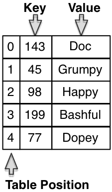

# Hash Tables {#hash}

## Introduction

A Hash Table is an array (aka Table) that uses a hash function to map keys to a specific location in the array. The position of the entry in the table is determined by the value of the key.

A hash table (also knowns as a Hash Map) is a more flexible version of an associative array that does not require that the key of the the key-data pair be something that easily maps to a position in a table.
Instead, the hash table calculates the table position by algorithmically manipulating (hashing) the key to determine the correct position in the table. A hash table is useful in situations where the data key-value
pairs might not have key values that are nicely distributed to allow them to be mapped to table positions between 0 and the end of the table.

The **Hash Function** a function that, when given a key as a parameter returns an integer within a fixed range. The hash function ALWAYS returns the same value for a given input, but may return the same value for more than one input. For example, a hash function could take in the province and plate number from a car licence plate (something like
ONBWCC123) and manipulate the digits and letters to produce an integer that maps to a position on the table. If the hash table were of size 357, the integer would be between 0 and 356.

The above image shows a 3x5 table. The first column is labeled as Table Position, the second shows the key, the third shows the value. There are five sets of data in the table.

The hash table shown is a simplified table that has the data stored directly in the table. A finished implementation of a hash table ADT would store void \* data in the same way that a linked list does. A hash table is nearly always implemented using an array, since the primary purpose of using a hash table to facilitate speedy lookups for data.

##### Real World Example:

Spelling checkers are an application that can employ a hash table. Because the dictionary of properly spelled words can be quite large, a search through that dictionary for each word in the document being checked is the most time consuming part of the operation. The dictionary can be read once into a hash table, where each word in the dictionary is put through a hash function and stored in the table at the appropriate position. In this example the word is both the key AND the data. After the table is loaded each word of the document to be spell checked is hashed.

## Hash Table Operations

The minimum set of operations for a hash table are exactly the same as the operations for an associative array.

The only change is the process for inserting and finding data because the hash table must use the hash function to determine where the new data goes and where the data can be found.

The implementation of the operations changes depending on the collision resolution strategy chosen.

##### Operations List (Minimum Set)
This is exactly the same operations list is for an associative array. The algorithms for the operations are also
the same and are not repeated here.

-   create(): HTable
-   destroy(HTable)
-   insert (HTable, key, value)
-   remove(HTable, key)
-   lookup(HTable, key):value
-   update(HTable, key, newValue)

## Hash Table Characteristics

Hash tables are relatively simple to implement and provide operations that are ideal for tasks that involve frequent look ups of the elements. Hash tables have several characteristics that distinguish them from other data structures.

-   Hash tables can provide an improvement over the search time for binary trees ( binary tree search time is O(log 2 n). The cost of search in a hash table is the time to execute the hash function + any time to resolve collisions which is usually O(1).

-   Hash tables are efficient for large sets of data, but sometimes the hash function is computationally expensive which makes other data structures more effective for small sets of data.

-   The most often used operations on a hash table are the operations for finding and inserting. These operations are dependent on the hash function. The selection of hash function is key to the efficient operation of the hash table.

-   The set of keys for the data is called the key space. The key space is often larger than the size of the table in memory (the address space), which means that often two elements must hash to the same location. When this happens the collision resolution strategy is used to ensure that both elements are stored and can be retrieved.

-   The hash function maps the key space into the address space. More specifically the hash function takes a key and uses it to produce an address that is in the defined address space of the allocated table. The same address must be produced every time given the same key.

-   Because the key space is typically larger than the address space, more than one key will be mapped to the same address. This is called a collision and must be handled through collision resolution. The selection of collision resolution method is an important part of hash table design.

## Hash Functions

The hash function must map the keys in the data to a position in the table. A hash function needs to know the size of the table (usually sentin as a parameter) in order to determine the appropriate position.

The characteristics of a good hash function are:

-   speed: the function cannot be slow to run

-   space: the hash function should not take a lot of storage space

-   generation of positions: the function should spread the keys out evenly across the whole hash table (no clustering in one part of the table)

All hash functions take in a key of a particular type as a parameter and return a value between 0 and the size of the table. Some hash functions are written with a hard coded table size, some take the table size as a
parameter. Some hash functions work on numeric keys, some work on alphanumerics. There are many different possible hash functions. The subsections below detail some possible approaches to writing hash functions.

### Before Hashing: Preconditioning

Keys in the key space frequently contain alphanumeric characters, but hash functions are often more effective on keys that can be manipulated numerically. One common approach to hashing is to convert alphanumeric keys to a numeric value through a process called preconditioning. Preconditioning can be as simple as replacing each letter with the ascii code for the letter, or it can do more complex manipulations such as normalizing the length of the keys in addition to converting them.

###  Hashing by Truncation

The **truncation** method of hashing simply uses a portion of the key as the address space and ignores the rest of the key. This method is also known as **Digit Analysis**

The truncation method only works for keys that have consistent characteristics. For example, suppose you had a set of 8 digit keys such as 46 234 789 and your hash table size was 1000 (hash values between 0 and 999).

One approach to truncation for hashing this number could be to simply select the 1 $^st$ , 3 $^rd$ and 5 $^th$ digits of the key (424 in this case). Another approach to truncation for hashing this type of key could be to select the first, third and last digits and then reverse the order (924 in this case).

The approach to truncation must be consistently applied to every key and must always give the same results, but otherwise any sort of digit manipulation that results in a suitably sized address space can be considered as an approach to truncation.

The truncation method has the advantage that it is very fast, but it often results in many collisions because the hashed values often don't distribute well within the entire table.

### Hashing by Folding

The **folding method** of hashing involves separating the key into parts that are the same length as the address space and performing some kind of math on those parts. Often one part is composed of the 'leftovers' and is a different length. A common method of folding is to add the parts together once the parts are identified, ignoring the final carry. The result is used as the table address for the original key.

For example, suppose that the key value of 456 987 321 must be hashed into a table of size 1000 (hash values between 0 and 999). The original key is partitioned into three segments, each three digits long and those segments are added together. 456 + 987 + 321 = 1764. The 1 thousand is ignored and the hash key becomes 764.

The folding method is a fast hashing algorithm and results in more evenly distributed addresses than truncation. Even though it is better than truncation, it can still result in poorly distributed addresses.

### Hashing by Division

Integer division can be used to consistently reduce a large integer to a small one. Recall the modulo operator, which is used to find the remainder value after integer division. 15 modulo 4 (15%4) yields the value 3. The only possible values from an expression that is modulo 4 is 0, 1, 2 or 3. If we use larger numbers, say 10000 modulo 999, the remainder value will have to be a number between 0 and 998. We can use this characteristic of modulo to calculate a hash value of a large
number.

The division method hash function calculates the hash value of a key, H(k) by finding the remainder that results from dividing k by some positive integer (modulo). More formally **H(k) = ABS(k)%m** where m is a large positive integer, % is the modulo operator and ABS is the absolute value.

The division method of hashing will return addresses that are between zero and one less than the divisor (m), so it is important that m is also the size of the table, otherwise this method will result in invalid addresses.

This method will map keys that are close in value to different addresses, but will map keys that are multiples of each other to the same address, so its effectiveness depends on the characteristics of the original key space. Consider the hash values calculated below, for an m value of 11.

  Key   Hash         
  ----- ------ -- -- --
  12    1            
  13    2            
  14    3            
  56    1            
  57    2            
  58    3            
  239   8            

The division method can result in very good distribution of address locations depending on the value chosen for m. The table size (m) should not be set to an even number, or a power of 2 or 10. Prime numbers, and odd numbers whose factors are all over 20 are good choices for the table size (m).

## Collision Resolution for Hashing

When two keys hash to the same table position we say that a **collision** has occurred. Even if the keys for the data are unique, it is likely that sometimes the hash function will calculate the same table position for two keys. When this happens, the hash table must find a different location to store the second set of data, since two pieces of data cannot be stored in the same memory location. The process oflocating the alternate storage location is called **collision
resolution**.

Two common approaches to collision resolution are **open addressing** and **separate chaining**. Open addressing solutions use an algorithm to search in a repeatable fashion for an alternate location. Separate chaining solutions create additional table space by using a linked data structure.

### Open Addressing

When a collision occurs in an open addressing hashing system, the collision is resolved by trying alternative cells until an empty cell in the hash table is found. In effect some number is added to the calculated cell position to arrive at a new cell to try, and the formula is set to wrap-around to the beginning of the table when the end is reached.

The number of filled cells in the hash table is used to calculate the *load factor* of the table (number filled/size of table). Open addressing is a collision resolution technique that works best with a table that has a load factor of .5 or less.

The offset is calculated by a collision resolution algorithm. A collision resolution algorithm must ensure that it always finds an empty cell if one is available. We will examine three open-addressing collision resolution algorithms that are used : linear probing, random probing, and double hashing. There are many more possible approaches and several variations on the three we will examine, but these three serve to illustrate the concepts behind open addressing to resolve collisions.

#### Linear Probing

Linear probing is a strategy that places the collided data in the next available cell. When the end of the table is reached, the search wraps around to the beginning of the table.

Suppose that the items in the table are names.

-   Sleepy is hashed to position 0

-   Doc and Grumpy are hashed to position 3

-   Sneezy is hashed to position 4

-   Happy is hashed to position 5

-   Bashful and Dopey are hashed to position 7

The table state, after each addition is shown in the diagram below.

While linear probing always finds a cell if one is available, it tends to cluster the data (as you can see in the diagram). This type of clustering is called **primary clustering**. Also, as the table gets full, the number of probes required increases which slows down insertions and searching.

#### Random Probing

One way to avoid primary clustering is to change the probing mechanism so that it does not return consecutive positions. The probing strategy cannot truly be random because must still generate every position in the table exactly once for any given collision, and it must generate exactly the same sequence again given the same collision. However, it does not need to generate new table positions in the order that they appear in the table.

One example of such a strategy adds some positive number to the location of the collision, and then finds the modulo value with respect to the table size.

    { newLocation = (mostRecentLocation + constant) mod tableSize}

This strategy works well when the constant and the tableSize share no common divisor other than 1. Random probing suffers from **secondary clustering**. Secondary clustering occurs when the same exact sequence of positions is generated when two keys are mapped to the same position more than once during a search for position.

#### Double Hashing or Rehashing

Double hashing is an effective collision resolution strategy that avoids clustering. When there is a collision of hashed values for keys, the colliding key is hashed again using a different hash function. The result of the second hash function is not used as a position, but is used as the constant value in the equation for random probing.

    newLocation = (mostRecentLocation + valueFromSecondHashFunction) mod tableSize

Double hashing usually eliminates clustering in the hash table because the sequence of values generate for any two colliding keys will not be the same.

### Separate Chaining

Separate chaining is another approach for handling hashing collisions. Rather than try to find an alternate table position, the separate chaining approach stores the colliding records for a single table position in a linked list. Instead of storing data directly in the hash table, the linked list is stored in the hash table at the hashed position. The separate chaining method requires memory storage space for the hash table as well as for the linked lists, so it is more memory intensive than an open addressing approach to collision resolution.

Separate chaining is often implemented so that none of the data items are stored in the actual hash table. Instead the hash table simply houses pointers to the linked lists of data that hash to that location.

Algorithms for separate chaining are easy to construct, as the first step is a simple lookup in an array and the rest of the data structure can be manipulated through linked list operations. If the hash function is good, there will be few collisions and the linked lists will be short.
Even though this technique requires more storage space than an open addressing approach, the simplicity and its performance make it a popular choice in hash table design.

## Additional Resources

An excellent hashing tutorial with several animations can be found here:

http://research.cs.vt.edu/AVresearch/hashing/

This tutorial reviews most of what we have learned in this lesson, and expands the topics somewhat. The animations are excellent and worth exploring.

