# Heaps

## Introduction

A heap is a special kind of complete binary tree. The key property of a
heap is that the target element (the minimum or the maximum) is always
stored at the root of the heap. This is done by reordering the nodes to
ensure that the property is true. A heap can be one of two types, a max
heap where the parent node is greater than its children, or a min heap
where the parent node is smaller than its children.

To be a valid heap, every element has to follow the heap rule. For max
heaps the rule is: $$value(parent) \geq value(child)$$ and for a min
heap the rule is: $$value(parent) \leq value(child)$$

A heap is considered to be a partially ordered data structure because
the elements within any given level have no defined ordering. Heaps are
commonly used as the implementation for a priority queue.

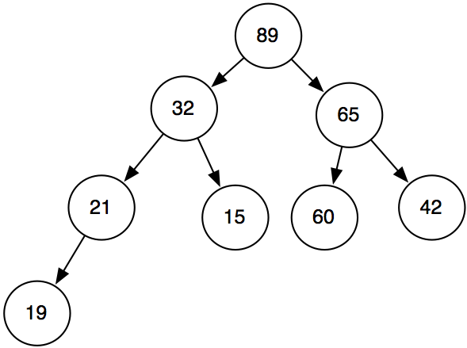 []{#fig:maxheap label="fig:maxheap"}

## Operations

A heap should provide the functionality to insert, delete, and retrieve
the min/max value. Additionally the heap must provide the standard data
structure operations of create, destroy and isEmpty. A robust heap
library should allow the library user to choose between min or max heap
capabilities when the heap is created. The minimum set of operations is
shown below.

-   insertHeapNode

-   deleteMinorMax

-   getMinorMax

-   createHeap

-   destroyHeap

-   heapify

The Heap ADT requires the same abstraction with void \* pointers,
operations to create nodes, and function pointers to compare, delete and
print data as the previous ADTs we have studied. The create, destroy,
and isEmpty functions are very similar to the same functions for other
ADTs and are not explained in detail here.

The insert and delete functions for a heap are the most complicated
operations.

### Heap Insert

A heap is a specialized version of a complete tree. This means that all
insertions must occur at the left-most side of the bottom level of the
tree in order to maintain the property of completeness. The algorithm
for adding an element to a heap follows:

    insertHeapNode(Heap * heap, void * data)
    {
        create a node from the data
        locate the next position in the heap (the left most position with no node)
        add the new node to the located position
        reheapify the heap to maintain the heap property
    }

The process of reheapification consists of swapping elements until the
heap property is satisfied or until the root of the heap is reached. The
pseudocode for reheapification is shown below.

    heapify(Heap * heap, Node * newNode)  //this is a heapify-down function
    {
         parentNode = get parent node of newNode
         while(newNode->data is greater than parentNode->data  //or less than for a min heap
         {
            swap positions of newNode and Parent Node
            parentNode = get parent node of newNode (has changed because of the swap)
         }
    }

### Heap Delete

The most common way to delete elements from a heap is to remove the
value at the root node as part of the the findMinorMax operation. To
remove the root node, you find the left-most leaf of the heap, replace
the root node with that node, and then reheapify downwards until the
heap property is satisfied.

     void * deleteMinOrMax(Heap * heap)
     {
        tempNode = heap->rootNode
        heap->rootNode = the node in the "last" position in the tree //the leftmost, bottom node
        outOfPlacePtr = heap->rootNode  // keep track of the node that you're moving into place
        remove the node in the last position //after copying it into the root
        while ( outOfPlacePtr->data is less than either left or right child)  //or greater than for a min heap
        {
            swap outOfPlacePtr and child with greatest value
        }
        return tempNode->data
     }

The delete process for the root node can be used to delete any node in
the heap. The node to be deleted is the root node of a subtree, and the
delete algorithm can be applied to the subtree instead of the entire
heap. The process simply requires an additional function to find the
target node first.

## Array Implementation of a Heap

Heaps can be implemented using a Binary Tree ADT. However, the property
that a heap is a complete binary tree allows a heap to be implemented
using an array. The array implementation removes the need for pointers
as the positions of the child nodes can be easily calculated. The first
empty position in the array is the next position to be filled.

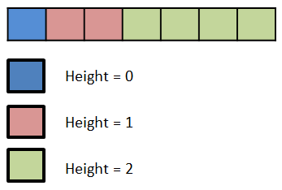 []{#fig:heap0 label="fig:heap0"}

The array is organized so index 0 is height 0, height 1 is indexes 1-2,
height 2 is indexes 2-5 and so on. The swaps necessary for inserting or
deleting elements can be accomplished simply by calculating the
appropriate array index.

### Adding Elements

Adding an element to a heap has a worst case complexity of O(height) or
O(log(N)), since there is a maximum of 1 swap per level of the heap.
(note: for an explanation of why the height of a heap is log(N) see the
complexity section in the References) The algorithm for inserting
elements does not change when an array is used for implementation. Only
the implementation details change. Consider the following example where
10, 23, 3, 32, 17 and 5 are added to a max heap.

We begin by adding 10 to an empty heap.

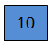 []{#fig:heap1 label="fig:heap1"}

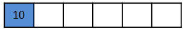 []{#fig:heap1a label="fig:heap1a"}

10 is added as the root of the heap at position 0 in the array. It is
the first level of the binary tree. We then add 23 to the heap.

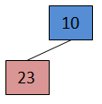 []{#fig:heap2 label="fig:heap2"}

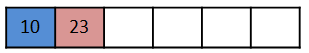 []{#fig:heap2a label="fig:heap2a"}

First, 23 is added as 10's child. It is placed in the first empty
left-most position in the tree, which is also the first empty position
in the array. Because 23 is greater than 10, the heap must be
reheapified.

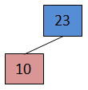 []{#fig:heap3 label="fig:heap3"}

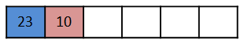 []{#fig:heap3a label="fig:heap3a"}

23 is compared to its parent value (10). 23 is larger so the two values
are swapped and 23 is the new root of the heap. 10 is the child of 23.
We then add 3 to the heap.

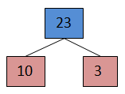 []{#fig:heap4 label="fig:heap4"}

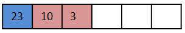 []{#fig:heap4a label="fig:heap4a"}

3 is added as the second child of 23. It is added in position 2 of the
array. 3 is compared to the value of its parent (23). 3 is smaller than
its parent value so no swap is needed. We then add 32 to the heap.

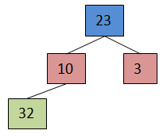 []{#fig:heap5 label="fig:heap5"}

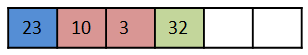 []{#fig:heap5a label="fig:heap5a"}

32 is added at the next, left-most position in the heap (the first empty
position in the array). 32 is compared with its parent value (10). 32 is
larger than 10 so the two values must be swapped.

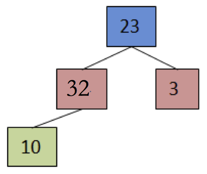 []{#fig:heap6 label="fig:heap6"}

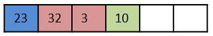 []{#fig:heap6a label="fig:heap6a"}

32 iis not the root of the heap, so we again compare 32 with its parent
value (23). 32 is larger than 23, so a swap must be made.

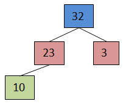 []{#fig:heap7 label="fig:heap7"}

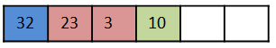 []{#fig:heap7a label="fig:heap7a"}

32 is the new root of the heap so no further comparisons are necessary.
We then add 17 to the heap.

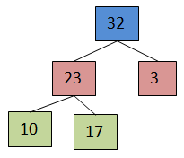 []{#fig:heap8 label="fig:heap8"}

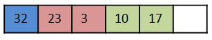 []{#fig:heap8a label="fig:heap8a"}

17 is added as a child of 23 to the first, left-most empty position in
the tree. 17 is compared to the value of its parent(23). 17 is smaller
than its parent value so no swap is required. We then add 5 to the heap.

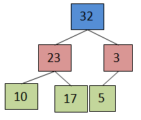 []{#fig:heap9 label="fig:heap9"}

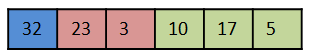 []{#fig:heap9a label="fig:heap9a"}

5 is added to the next position in the heap, as the first child of 3. 5
is compared to its parent value (3). 5 is larger than three so the two
values must be swapped.

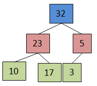 []{#fig:heap10 label="fig:heap10"}

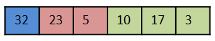 []{#fig:heap10a label="fig:heap10a"}

Finally 5 is compared to its new parent (32). 5 is smaller than 32 so no
swap is necessary.

It can be seen that the final array representation is not fully sorted,
and not fully segregated by value ranges (5 has a height of 1, higher
than 10 and 17). Nonetheless the heap rule holds and the partial
ordering of the heap can easily be maintained by swaps.

### Removing Elements

Elements of a heap are generally removed from the root, or the
largest/smallest element in the structure. The root is then filled with
the most recent added element , and the heap is resorted by swapping
with the larger child until it satisfies the heap property. If it is
necessary to remove an interior item from a heap, the subtree rooted in
the item to be removed is handled in the same fashion as the entire
heap.

Removing an element will always result in a complete tree because only
leaf nodes are actually removed after the value is swapped in to a new
spot.

The complexity of a deletion is O(height) or O(log(N)) since there is a
maximum of 1 swap necessary per height.

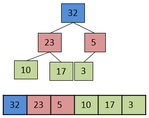 []{#fig:heap11 label="fig:heap11"}

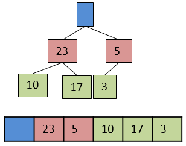 []{#fig:heap12 label="fig:heap12"}

The root is removed, leaving an empty spot in the heap.

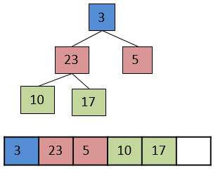 []{#fig:heap13 label="fig:heap13"}

The most recently added element is copied to the root position. The most
recently added node is deleted. The new root node(3) is compared to both
of its child nodes (23, and 5). 3 is less than at least one of its
children so it must be swapped. The heap does not follow the heap rule,
a sort must be done.

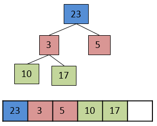 []{#fig:heap14 label="fig:heap14"}

3 is swapped with the larger child, 23. 3 is now compared with its new
children (10 and 17). 3 is smaller than at least one child, therefor the
heap still does not satisfy the heap property. Another swap must be
performed.

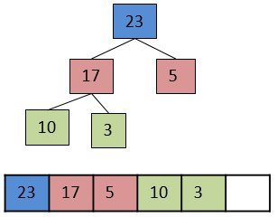 []{#fig:heap15 label="fig:heap15"}

3 is swapped with the larger child, 17. The heap property is now
satisfied.

## Extending Activities

-   Develop a formula to calculate the position of a parent node in an
    array-implementation of a heap. The only input information to the
    formula is the position of the current node.

-   Create the C struct for a binary-tree based heap. Your struct should
    have members for the heap, the last added element, the next
    position, and function pointers to manipulate void\* data.

-   Heaps do not have to be binary trees. Many variations of heaps are
    possible. Use internet resources to learn about one of the following
    different types of heaps: skew heaps, binomial heap, or leftist
    heap. Write the pseudocode for insert and delete operations for the
    type of heap you chose.

-   The complexity of insert and delete for a binary heap is O(log(N)).
    Why is that? Create a written explanation, chart, or diagram that
    explains why log(N) is the complexity for those operations.
