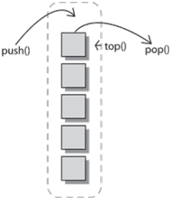
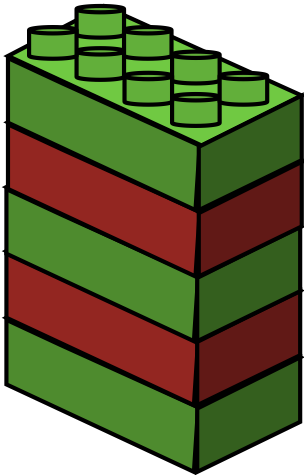
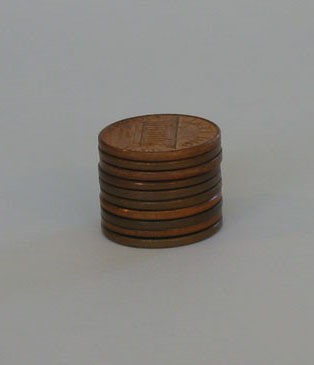
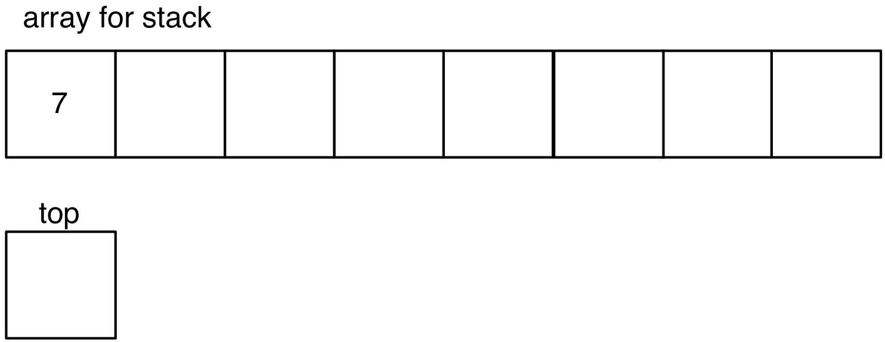
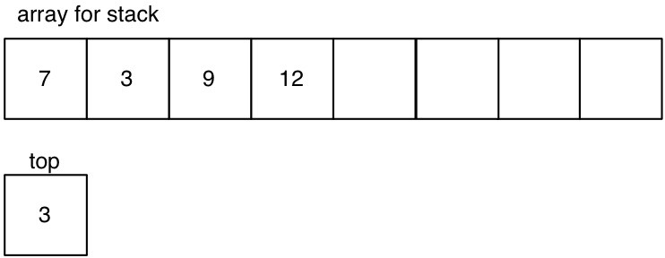
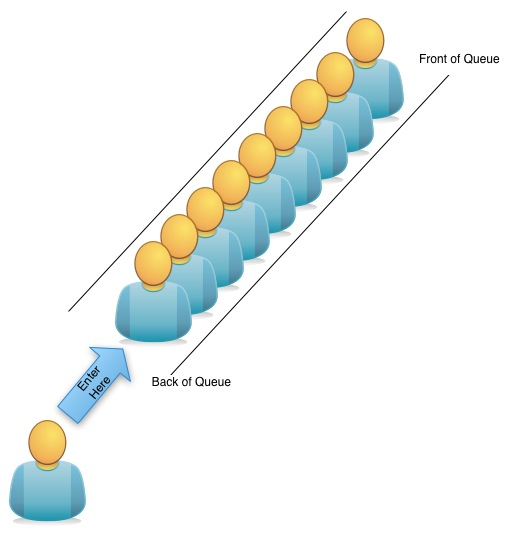
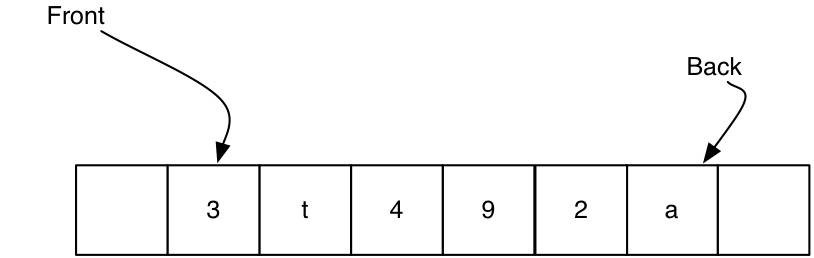

# List ADT {#lists}

## Introduction

Usually when we write programs we don't know how many records or data
items will be available to the program. Frequently that number isn't
known even when data is entered into the program. Data storage
structures like arrays are sometimes inconvenient because the length of
an array must be known in order to allocate memory for the structure
before data can be entered.

Linked Data structures solve this problem by allocating exactly enough
memory for a single data item, filling the item, then allocating enough
memory for the next item and connecting the two together so that they
form a collection of data items. This process is repeated for however
many items there are.

These types of constructs are called **dynamic data structures**. Don't
confuse this term with dynamic memory allocation- the word dynamic
simply means that the action happens as the program is executing. So
dynamic memory allocation (malloc) happens during program execution and
a dynamic data structure is created during program execution, but the
two things are separate.

## Linked Lists

A linked list can be constructed in several different ways.The
differences between the construction is in the number and purpose of the
pointers in the node structure. Sometimes all that is needed is a simple
list, where the first item in the list leads to the second item which
leads to the third item and so on. This is called a **singly linked
list**. A singly linked list provides no mechanism to return to the
previous item. Imagine a collaborative story-writing task where each
person writes a sentence on paper and then passes the paper to someone
else who writes another sentence on the paper. At the end of the task,
there is a story on each piece of paper and the last author is holding
the list of sentences, but there is no record of who the previous
authors were. That is how a singly linked list works.

A **double linked list** provides a mechanism to identify both the next
item on the list as well as the previous item on the list from any
position in the list. A double linked list is similar to a group of
people standing in line. Any individual person can identify both the
person ahead of them in the line and the person behind them.

A **circular linked list** is a list of a fixed size. The last element
of the circular list is connected to the first element of the list so
that from the last element the program can easily return to the first
element. A circular linked list doesn't really have an end point.

The next three images show a singly linked list, a double linked list
and a circular linked list

{#fig:single width="50%"}

{#fig:double
width="50%"}

{#fig:circular
width="50%"}

### Implementation Details

When you write the operations for a linked list, the most challenging
aspect is to keep track of the pointers that give access to the adjacent
nodes in the list.

The pseudocode below illustrates the process for adding an element to
the beginning of the list. This pseudocode assumes that currentElement
is the beginning of the list and that newElement has already been
allocated and is pointing to the list data. The order of these two lines
of code is very important. Can you explain why?

           newElement-$>$next = currentElement-$>$next     
           currentElement-$>$next = newElement

The following steps are required to add a node to the end of the list:

1.  Initialize a new element with the desired data. This should be a
    separate function call.

2.  Walk through until end of list is reached

3.  Set the *next* attribute of the element at the end of the list to
    the new element.

The most challenging part of this algorithm is Step 2, walking through
the list. This is an operation that you will find yourself doing
frequently with linked data structures. The pseudocode for that step is
shown below. Draw a list on some paper and work through the algorithm
until you understand how to walk through a list to get to the end of the
list.

    currentElement = firstElementOfList //usually called the head of the list
    while(currentElement->next is not NULL)
        currentElement = currentElement->next
    lastElement = currentElement

### Nodes

A node, or element, is the fundamental structure within a list.
Regardless of your choice of implementation for a list, you will need
some kind of a node structure to contain the data for the list.

When we take the time to create an ADT, we want it to be truly abstract.
That means that the ADT should not be tied to a particular kind of data,
since the operations on a list are identical whether it is storing
integers, strings, or structs. It is a waste of time and testing to
create separate ADT libraries for every possible type of data.

Instead we abstract the data by creating a data structure called a
**node**. As a minimum, the node contains a pointer that points to the
data being stored, and a pointer to the next node in the list.

    typedef struct Node {
        void * data;
        struct Node * next;
    }Node;

The type of the data doesn't matter because it is cast to a void pointer
(void \*). The data stored in the list might be a string; it might be an
integer; or it might be a complex struct that represents a larger data
record about some entity.

A linked list ADT should have a function that creates a new node, sets
the next pointer to NULL, and assigns the data to the data pointer.
Algorithms for working with linked lists assume that the **next
pointer** for the tail element is set to NULL so that the end of the
list is easily identified. It is very important to ensure that all new
nodes have their next pointer initialized to NULL.

The data stored in a linked list is separate from the node definition. A
node simply points to the data element. Suppose you were storing
addresses in the list. The data representation would then contain
elements for name, phone number, mailing address and possibly email
address. A struct to represent the data might be given as follows.

    typedef struct Address {
        char * name;
        char * telephone;
        char * mailingAddress;
        char * email;
    } Address;

### Operations

A list ADT typically provides functions that add elements to the list,
remove elements from the list, report how long the list is, and possibly
sort the list. It also must provide functions to create and destroy the
list.

A minimum set of operations is shown below. The names of the functions
can vary, but an operation with comparable functionality is necessary.
The parameters given in the pseudcode are also a minimum set of
parameters. Implemented functions may need additional parameters.

    ·create(...): List
    ·destroy(List)
    ·insertFront(List,  DataElement):theHead
    ·getFront(List):DataElement
    ·deleteFront(List)

Once a list is created, it is manipulated through operations on the ADT
functions. These functions and procedures can do whatever the programmer
desires, as long as they are written carefully to **encapsulate** the
implementation details of the list. While a list ADT is functional with
just the minimum set of functions, usually more functions are provided
with an ADT. Some common additional operations on lists include

-   Finding the length of a list

    -   returns an int and takes the root of the list as a parameter

    -   getLength(List):int

-   Finding an element of a list

    -   returns a pointer to the element in the list, without removing
        the element from the list

    -   needs a search criteria and the list as parameters, and returns
        a pointer to the data element, not the node

    -   find(Element, List)

-   Printing a list.

    -   might print the entire list to stdout

    -   a more elegant version returns a string (or pointer to a string)
        that represents a nicely formatted printout of the list
        elements.

    -   print(List):char\*

-   Adding/removing Nodes at the end of the list

-   Adding/removing nodes after or before a specific element

-   Adding/removing nodes in a specific position in the list

-   getting the length of the list

-   **Iterator** operations (current, next, previous, head, tail)

    An iterator is a function that allows the user to step through the
    elements in a data structure. Iterators typically "remember" the
    current position so that the user can move backwards and forwards
    within the data structure.

### Adding Elements

Elements can be added into a list at the beginning, in the middle, at
some arbitrary location, at the end, etc. Each insert algorithm is
slightly different than the others but the basic idea is the same in all
cases.

1.  Construct a new list element

2.  Put the desired data into the new element

3.  Find the location where the element is supposed to be inserted

4.  Adjust the other list elements so that the new one is in the right
    location and so all existing elements are still part of the list

Algorithms for inserting an element in the first position and last
position are shown below. The pseudocode or algorithm for inserting in a
specific location is left as an exercise for you to do.

    insertFirst(List, Element):theHead
    Also Known as:addFront, insertFront, addHead, etc
    Purpose: To add an element to the list at the front of the list
    Preconditions: An initialized list is available.  
    PostConditions: The node containing the desired data is added to the front of the list, the length of the list is increased by one, the head of the list is set to point at the newly added element.

    insertFirst(List, Element):theHead
         initialize a new node with the desired data
         set the next pointer of the new node to point at the first nod of the list
         set theHead  of the list to point at  the new node

    insertLast(List, DataElement):void
    Also Known as: addBack, insertBack, addTail, etc
    Purpose: To add an element to the list at the tail of the list
    Preconditions: An initialized list is available.  The new node has the next pointer initialized to NULL
    PostConditions: The node containing the desired data is added to the end of the list, the length of the list is increased by one.

    insertLast(List, DataElement):void
        initialize a new element with the desired data.  
        walk through until end of list is reached 
        set the next attribute of the element at the end of the list to the new element.    

### Deleting Nodes

Deleting nodes in a list uses algorithms that are the reverse of adding
nodes. Nodes can be deleted from the front, the back, or any location in
the list. The simplest algorithms delete nodes from the front or the
back of the list.

    deleteFront(List):Element  //often a delete method returns the value it has deleted
    Also Known As: deleteFirst, removeFront, removeFirst
    Purpose: To remove the first element from the list and return it to the calling procedure
    Preconditions: A non-empty list is available
    PostConditions: The first element of the list is removed, the length of the list is decreased by one,  the removed element is returned.

    deleteFirst(List):Element
        set a temporary pointer(temp) to point at the first node in the list
       set the head pointer of the list to point at the second node in the list
       set the next pointer of the temporary node (the former first node)  to be NULL
        return(temp->data)

    deleteFromBack(List):Element  //often a delete method returns the value it has deleted
    Also Known As: deleteLast, removeBack,  etc
    Purpose: To remove the last element from the list and return it to the calling procedure
    Preconditions: A non-empty list is available
    PostConditions: The last element of the list is removed, the length of the list is decreased by one,  the removed element is returned.

    deleteLast(List):Element
        walk the list to find the second last element //node->next->next == NULL
        set a temporary pointer(temp) to point at the last node in the list
        set the next pointer of the second last element to NULL
       set the next pointer of the temporary node (the former last node)  to be NULL
        return(temp->data)

### Other Core List Operations

    isEmpty(List):Boolean
    Purpose: To determine if the list has any elements stored in it   
    Preconditions: An initialized list is available
    PostConditions: None

    isEmpty(List):Boolean
        if theHead == NULL and theTail == NULL
        then return (true)
        else return (false)

isFull() is a function that is only useful in situations where a list
could be full. This might happen in situations where a specific amount
of memory has been allocated to the list. In that case when the memory
is full, a reallocation must be effected before the list size can be
increased by adding another element.

    isFull():Boolean
    Purpose:To determine if the list is filled to capacity
    Preconditions: An initialized, non-empty list is available
    PostConditions: None
       
    isFull():Boolean
        if length == maxSize
        then return (true)
        else return (false)

    create(...): List
    Purpose: Create a new List initialized to be empty
    Inputs: the function pointers for functions to manage the data stored in the list
    Preconditions: None
    PostConditions: A new list is created and is empty

    create(...):List
        create the struct to hold the list metadata (head, tail, function pointers, etc)
        assign NULL to head (and tail if necessary)
        assign function pointers
        return(List)

    destroy(List)
    Purpose: To destroy a list, freeing memory if required
    Preconditions: A list exists
    PostConditions: The list is destroyed

    destroy(List)
       for each node in the list
           delete the data in the node using function pointer
           delete the node
       delete the struct holding the list metadata

## Array implementation for a list

The previous sections of this document have focussed on the list
composed of linked data structures (the linked list). A list ADT does
not have to be a constructed using linked nodes. An array can be used to
construct a List ADT. At its simplest, the array holds the data in the
list and each location in the array is one element of the list. The head
of the list is at the first position in the array and the tail of the
list is wherever the last element is.

The array-based list stores void \* data in the array in the same way
that the linked node stored void \* data for the linked data structure.

The choice of implementation does not change the operations required for
the list ADT but it does change some of the implementation details. For
example, if the user wished to insert data into the list maintaining a
sorted order, the insert operation would require that room is made for
the new element by shifting any subsequent elements one position in the
array. If a data value was to be deleted from the list, the delete
operation must ensure that the space left from the deletion is filled by
shifting the tail-end of the array one space towards the head.

Because arrays must be allocated to be a fixed size in C, a new longer
array must be constructed and the data copied into it if the list grows
longer than the size of the array.

Fortunately, because of information hiding and encapsulation, the user
of the the List ADT should never need to know whether the List is
implemented as a linked data structure or an array-based list.

##  Array Lists vs Linked Lists

**Linked Lists**

-   Advantages

    -   Linked lists can be an arbitrary size because the list grows and
        shrinks as elements are added.

    -   Insertion and deletion of data do not require moving other data
        elements, so the operations are more efficient than the
        comparable operation on an array structure.

-   Disadvantages

    -   Linked lists are less efficient in situations where the program
        must be able to access any element of the data at any point in
        the program. This type of accessibility is called **random
        access** and is more efficiently implemented with an array.

**Array Lists**

-   Advantages

    -   Many operations are very fast because the array indices provide
        direct access

    -   functions are simple and easy to debug, making ADT development
        simpler

-   Disadvantages

    -   The resizing operations can be processor intensive if the list
        is large. There are many different strategies for deciding how
        much bigger to make the new array when resizing.

    -   To keep an array sorted, you must shuffle the elements each time
        you add another element.

## List Iterator

An iterator is a mechanism that allows navigation of a data structure.
An iterator is usually a different structure (or class in the case of
object oriented programs) that is fairly tightly coupled with the
implementation of the data structure being iterated.

When creating an ADT library in C, iterator functions can be included
easily either with, or without the use of additional structures.

List iterator methods permit forwards and backwards navigation of the
list. They are extremely useful for accomplishing insertions and
deletions because the navigation code is encapsulated within the
iterator operation.

Iterator methods for a list might include:

-   next()

-   previous()

-   first()

-   last()

-   moveToNth()

-   getCurrentElement()

-   setCurrentElement()

While some of the iterator methods might seem to be duplicates of the
basic list functions, an iterator has an important role to play in
encapsulation. An iterator can hide the implementation of the list from
the user of the library and can provide only the navigational functions
to the user.

For example, an iterator for a list could be set up as follows:

    typedef struct Iterator
    {
        List * theList;
        Node * currentListPos;

    }ListIterator;

Given this structure, the functions shown above could take a
ListIterator as a parameter and provide the user with data that is
stored in the list. Of course, the ListIterator would need to be
initialized with enough parameters that it could, in turn, initialize
the underlying list.

An algorithm for the *next()* function is shown below.

    next(ListIterator):DataElement  
    Purpose: To move to the next element in a list and return the value of that element
    Preconditions: The List member of the ListIterator is non-empty
    PostConditions: The currentListPos of the iterator is increased by one and the data stored at that node is returned

    next(ListIterator):DataElement  
        if currentListPos is not the end of the list
           dataToReturn = currentListPos->data
           currentListPos = currentListPos->next
        return (dataToReturn)

Some list iterator operations, such as previous() are easier using a
double linked list, but all operations are possible regardless of list
implementation. The algorithm for other list iterator operations are
left as a practice exercise.

## Extending Activities

-   Write an algorithm for the addToLocation() operation. This operation
    should add an element to the list at a specific location in the list
    (identified by a number). Use the same specification format as has
    been used to describe operations in this lesson. Include all
    necessary parameters and return values in the signature of your
    specification. Be sure to include preconditions and postconditions

-   Write the algorithm to delete a node from the nth position of a
    linked list. The operation should return the deleted data and ensure
    that the remaining elements of the list are properly connected.

-   Write the algorithm for inserting a node in sorted order given an
    array implementation of a list. The algorithm should take the data
    as a parameter.

-   Write the algorithm for the list iterator operation *previous()*. It
    should take a ListIterator as a parameter and return the data
    associated with the previous node. It should also adjust the current
    position pointer. Write the algorithm for a double linked list and
    then write it again for a single linked list.

# Stack ADT

A full understanding of the List ADT is needed in order to fully
understand stacks. If you do not understand how lists work and the
associated operations of lists, please review that material before
attempting to understand the Stack ADT.

{#fig:stack}

A stack is a linear data structure in which all insertions and deletions
occur at the head, or top of the stack. A stack ADT can only be
interacted with from the front, or top, of the stack. Items can be
placed on the top, and then taken off the top, but never shuffled or
sorted through. A stack of building blocks on a base is a good visual
metaphor for a stack. Imagine that you want to add height to the stack
of blocks- you add blocks to the top of the stack. To reduce the height
of the stack of blocks, you remove blocks from the stack.

{#fig:lego}

Another good metaphor for a stack is a stack of pennies. If you want a
penny of a specific year on top you could remove pennies from the stack
until you reach it. If the penny you want is on the bottom of the stack
you would need to remove every penny above it in order to get to it. You
couldn't just pull it out from beneath all the other pennies. And no, a
stack implementation won't let you knock over the stack and grab the
penny you want.

{#fig:pennies}

## Why use stacks?

Often programmers feel that if they have one usable data structure that
is enough. The list ADT is powerful and flexible and many programmers
use it for all purposes. However, there are many times when a special
purpose ADT is more appropriate. Some applications do not require the
flexibility of a list, but need to meet speed or data storage
requirements. A specialized ADT can often reduce overhead and speed up
operations. Below are some additional reasons to be familiar with and
understand multiple different types of ADTs.

-   A program becomes more readable and errors become easier to find
    therein if explicit use of specialized data structures is made.

-   Simpler interfaces (like in the case of the class stack) make
    specialized implementations possible which are particularly time or
    space efficient. For example, the Stack ADT could be implemented
    with the help of a particularly space-efficient list ADT, thus
    reducing space requirements overall.

-   The use of a specialized data structure often leads to more insight
    into the problem definition from which further improvements in the
    implementation can arise then.

-   To give an example: That a given stack will store only a certain
    number of elements known in advance during the overall runtime could
    be noticed by the programmer only by explicit use of a stack. A
    b_stack then would be the structure of choice and its use would
    imply an improvement of the space efficiency.

## Operations on a Stack ADT

A Stack is a **LIFO data structure**. LIFO stands for Last In, First
Out. The last element to be placed in the stack will be the first to be
removed from it.

The most modular way to create a Stack ADT is to encapsulate a List ADT.
To create a stack using an encapsulated list, you simply make use of the
operations provided by the LIST ADT. For example, a list ADT might have
operations such as addHead, removeHead. Those operations can be used
inside the Stack ADT to provide the operations needed by the Stack.
Often a Stack ADT is implemented as a **wrapper** around a List ADT. In
the same way that the ListIterator used the List ADT and provided
iterator operations to the user while hiding the details of the list
from the user, the Stack ADT uses the List ADT and provides stack
operations.

A Stack ADT structure might look as follows:

    typedef struct Stack
    {
        List * theList;
        Node * top;  //top of the stack
        int stackSize;
    }Stack;

The operations provided with any Stack ADT must allow for creation and
destruction of the stack as well as insertion and removal of elements as
a minimum. Because the goal is an **abstract** data type, the stack must
be initialized with pointers to functions for managing the stored data.

Since the Stack ADT presented here is a wrapper around a List ADT, most
of the stack operations simply call the operations of the underlying
list. The Stack ADT hides the list operations from the user of the
stack.

    create(): Stack
    Purpose: To create and initialize a stack
    PreConditions: None
    PostConditions: A stack is created and initialized to empty

    create(): Stack
          create the List sending in the appropriate function pointer parameters
         set the top  pointer to the first position in list
         return (the stack we just created)

    destroy(stack)
    Purpose: To destroy a stack
    PreConditions: An initialized stack exists
    PostConditions: The stack is destroyed and all associated memory is freed.

    destroy(Stack)
         destroy theList using the list ADT destroy function
         destroy the top pointer
         destroy the stack struct

The push() function of a stack is equivalent to the addFront() function
for a list. One of the main purposes for creating the specialized ADT is
program readability and maintainability so it is important to use
function names that are widely associated with the specific ADT.

    push(Stack, Element)
    Also Known As: add, insert
    Purpose: Places an element in the stack
    PreConditions: The stack is not full
    PostConditions: An element is added to the stack, the length is increased by one, the top of the stack points to the newly added element

    push(Stack, DataElement)
         insertFront(theList, DataElement)  
         top is set to the position of the data just added
         stackSize is increased by one

    pop(Stack): Element
    Also Known As: remove, delete
    Purpose: Removes the first element in the stack
    PreConditions: The stack is not empty
    PostConditions: The first (top) element of the stack is removed and returned to the caller. The top of the stack is set to the successor of the removed element, the length of the stack is decremented by one.

    pop(Stack):Element
         theRemovedElement  is set to the return value of getFront(theList)
         the first element of the list is removed  by calling removeFront(theList)
         top  is set to  the new first element of theList 
         return(theRemovedElement)

    peek(Stack): Element
    Also Known As: top
    Purpose: To examine the element at the top of the stack without removing it from the stack.
    PreConditions: The stack is not empty
    PostConditions: Returns the element that is at the top of the stack but does not remove that element from the stack.

    peek(Stack):Element
         theValue  is set to point at the data element at position (top) in the list. Sometimes a copy of the data element is made rather than providing a pointer to the actual data element.   Use the list operation getFront(List)
         return (theValue)

    isEmpty(Stack): Boolean
    Purpose: To determine if the stack is empty
    Preconditions: An initialized stack exists
    PostConditions: evaluates to true if the stack has no elements, false otherwise

    isEmpty(Stack):Boolean
         if(theList is empty)  //use the List isEmpty() function
         then return(true)
         else return(false)

    isFull(Stack): Boolean
    Purpose: Relevant only in situations where the size of the stack is limited. Is used to determine whether the stack is full.
    PreConditions: An initialized stack is available
    PostConditions: Evaluates to true if the stack has reached its maximum size, false otherwise.

    isFull(Stack):Boolean
         if(theList is full)  or the MAX_SIZE of the stack has been reached
         then return(true)
         else return(false)

The size of a stack is often an input that is used in algorithms
involving a Stack ADT. As such it is an important piece of data to keep,
even if the underlying list implementation does not keep a length. Stack
operations may need to have logic added to update the stackSize struct
member.

    length(Stack): int
    Purpose: To obtain a count of the number of elements currently in the stack
    PreConditions: An initialized stack is available
    PostConditions: returns the count of the number of elements

    length (Stack): Int
         return  stackSize  (or theList->length if the list ADT keeps track of length)

## Array Implementation of a Stack

Arrays can also be used to create a stack ADT. To use an array as a
stack you simply need to ensure that the elements are added to the array
sequentially and that your stack ADT keeps track of where the 'top' of
the stack is in the array.

For example, suppose we allocated an array of size 8 to store a stack of
integers, and a separate variable called top to keep track of the
position of the top of the stack. The figure below shows the array after
the integer 7 has been pushed onto the stack. The variable top has the
value 0 because the top of the stack is at position 0 in the array.

{#fig:stack1}

After three more elements are pushed onto the stack, the array contains
four items and the top variable holds the value of 3 because the top of
the stack is at position 3 in the array.

{#fig:stack2}

If an element is popped off the stack, the array then holds three
elements and the top variable would hold the value 2 because the top of
the stack moves to position 2 when an element is taken off the stack.

An array implementation of a Stack ADT needs to provide the same set of
stack operations as the encapsulated list implementation. However, the
operations will not call list ADT operations, they will directly
manipulate the array. Because an array is a fixed size, your ADT will
need to provide an isFull operation so that programmers using your ADT
can avoid overflowing your stack.

## Applications

A stack reverses the order of the elements stored. This property makes a
stack very useful in certain programming applications including memory
management and many mathematical applications

It is always a good idea to use the correct data structure for the
problem. While you could use a list for everything, the use of the more
specialized data structures makes your code more readable and makes it
much easier to see errors of logic. A specialized data structure can be
created with efficiencies designed to make the program faster, or use
less memory. Also, specialized data structures make it easier for the
programmer using the ADT to conceptualize the problem. If a programmer
is using a stack ADT for a program that requires the properties of a
stack, then the programmer cannot make errors such as taking a data
element out of the middle.

#### Reverse Polish Notation (Postfix notation)

The most common mathematical notation is *infix* notation. The operators
appear between the operands for the operation (e.g. 1 + 2, 5 \* 4, a/b).
Infix notation is ambiguous by itself and must be annotated with
parenthesis and a set of rules for the order in which operations are
carried out.

For example, consider the arithmetic problem 7 \* 5 - 4 \* 2. The answer
could be 23 or 61 or ??. The 'right' answer is clear to those who
understand the order of operations rules.

A polish logician, Jan Lukasiewicz, developed a notation that does not
require parenthesis and that embeds the required order of operations in
the notation. Statements are read from left to right and the previous
two operands are evaluated when an operator is encountered. The table
below shows several examples of Infix and the equivalent Postfix
notation.

  Infix              Postfix            
  ------------------ ------------ -- -- --
  a + b              ab+                
  (a-b)\*c           ab-c\*             
  (a+b)/(b\*a)       ab+ba\*/           
  (a\*(b+c))/d       abc+\*d/           
  a\*((b-c)/(d+e))   bc-de+/a\*         

Consider the second example. Reading left to right, the first two
operands are a and b, the next character is a minus sign, so b is
subtracted from a giving an answer that is stored as a single operand.
The next item read is a c which is an operand. The next item read
indicates multiplication so c is multiplied by the next most recent
operand, which is the result of subtracting b from a.

Work through each of the examples in the table so that you are confident
in working with postfix notation.

A stack is the data structure of choice for creating a reverse polish
calculator. Each time you read a character from the input stream you
push it onto the stack. When an operation is encountered, you pop two
operands off the stack, perform the operation, and push the result back
onto the stack. You then continue reading the input stream.

Consider, once more, the second example in the table. As the input
stream is read, a is pushed onto the stack, followed by b. The next
character is an operand so two pop operations are executed and a-b is
calculated. The result is pushed onto the stack. At this point the stack
contains one value. The next symbol is read and is pushed onto the stack
because it is not an operand. There are now two elements on the stack.
The final symbol is read, two pop operations are executed and the
multiplication operation is executed.

## Resources

There are many good resources about stacks on the internet. A few are
listed below, but this is only a small sample. It is worth spending some
time to find resources that work well for your personal style of
learning.

-   http://www.cs.bu.edu/teaching/c/stack/array/

-   http://www.algolist.net/Data_structures/Stack

## Extending Activities

-   Would a double linked list or a single linked list be a better
    choice for encapsulation in a Stack ADT? Justify your opinion.

-   Write the algorithms for push() and pop() given an array
    implementation of a stack. Show the stack struct definition as well.

-   Create a design or prototype of a reverse polish calculator program.
    You should limit operations to + - \* and /. Use a stack ADT in your
    design.

# Queues

## Introduction

A queue is an example of a **FIFO data structure**. FIFO stands for
First In First Out. The defining characteristic of a FIFO data structure
is that the data that has been stored the longest is the next piece of
data that will be returned by a 'get data' operation. FIFO data
structures do not allow the user to retrieve specific pieces of data.

{#fig:queue width="50%"}

A Queue ADT usually has no size restrictions and can grow or shrink
unrestricted. In some applications it is possible to constrain the size
of the queue to some predetermined maximum, which allows the software
developer to select extremely efficient representations for the queue.

Similar to the Stack ADT, one of the most common implementations for a
Queue is the encapsulation of a List ADT. Because a Queue typically does
not have a size, it is most common to use a linked list as the
encapsulated ADT but an array implementation of a list could be used
where max size is known and the characteristics of arrays give some
needed performance advantage.

## Implementation: Encapsulate List ADT

The most modular way to create a Queue ADT is to encapsulate a List ADT.
To encapsulate an ADT you write your new ADT using the encapsulated one
as a variable or data structure.

The Queue ADT must retrieve data elements from the front of the list
(getFront(List)) and add elements at the back of the list
(addToBack(List)). If the chosen List ADT does not provide an addToBack
function, it cannot easily be used as the underlying ADT for a queue.

Encapsulation makes it possible to write the Queue ADT operations
without worrying about the actual representation or memory management.
By using a good List ADT we ensure that the representation and memory
management are handled properly, and we make use of that to create our
Queue.

The minimum set of operations on a Queue are:

-   create()

-   enqueue() //AKA add()

-   dequeue() //AKA remove()

-   destroy()

Other optional but useful operations allow the programmer to examine the
front of the queue, determine the length of the queue, discover whether
the queue is full or empty, etc.

The encapsulated Queue ADT is usually represented by a struct that is
accompanied by several functions. One possible representation of the
struct is shown below.

    typedef struct Queue{
        List * theList;
        Node * front;
        Node * back;  //back is optional
        int * length;
    }Queue;

    create(): Queue
    Purpose: To create and initialize a queue
    PreConditions: MAX\_LEN has been defined previously (it could be passed in as a parameter if desired)
    PostConditions: A queue is created and initialized to empty

    create(): Queue
         theList  is set to point at the return value from create a list- sending in the appropriate function pointers
         front  is set to point at the first position in list
         back  is set to point at the last position in list  //back is an optional pointer
         return (the queue  just created)

    destroy(Queue)
    Purpose: To destroy a queue
    PreConditions: An initialized queue exists
    PostConditions: The queue is destroyed and all associated memory is 
           freed.

    destroy(Queue)
         destroy theList using the list ADT destroy procedure
         destroy the front and back pointers
         destroy the Queue struct

    add(Queue, DataElement)
    Also Known As: insert(), enqueue()
    Purpose: adds an element to the end of the queue
    PreConditions: The queue is not full
    PostConditions: The new element is added as the last element in queue

    add(Queue, Element)
          insertBack(theList, DataElement)
          back pointer is set last position of theList
          length of queue is updated

    remove(Queue):DataElement
    Also Known As: delete(),  dequeue()
    Purpose: removes the first element in the queue
    PreConditions: The queue is not empty
    PostConditions: The first (front) element of the queue is removed and 
           returned to the caller. The front of the queue is set to the successor 
           of the removed element.

    remove (Queue): Element
         theRemovedElement <- getFront(theList)
         remove the first element from the list
         front is set to point at the new first element of theList
         length of the queue is updated
         return(theRemovedElement)

    peek(Queue):Element
    Also Known As: front()
    Purpose: To examine the element at the front of the queue without 
           removing it from the queue.
    PreConditions: The queue is not empty
    PostConditions: Returns the element that is at the front of the queue 
           but does not remove that element from the queue.

    peek(Queue):Element
         return(getFront(theList)

    isFull(Queue):Boolean
    Purpose: Relevant only in situations where the size of the queue is 
           limited. Is used to determine whether the queue is full.
    PreConditions: An initialized queue is available
    PostConditions: evaluates to true if the queue has reached its maximum 
           size, false otherwise.
           
    isFull():Boolean
         if(theList is full)  OR MAX_SIZE has been reached
         then return(true)
         else return(false)

    isFull(Queue):Boolean
    Purpose: To obtain a count of the number of elements currently in the 
           queue
    PreConditions: An initialized queue is available
    PostConditions: returns the count of the number of elements

    isEmpty():Boolean
         if(theList is empty)
         then return(true)
         else return(false)

    length(Queue):int
    Purpose: To obtain a count of the number of elements currently in the 
           queue
    PreConditions: An initialized queue is available
    PostConditions: returns the count of the number of elements

    length(Queue):int
         return length OR length(List) if the list ADT provides a length function

## Array Implementation of a Queue

Queues can be implemented using an array in much the same way as a Stack
ADT can be implemented with arrays.

{#fig:arrayQueue
width="50%"}

The programmer must keep track of the front and the back positions of
the queue and, if a linear array is used, items must be shuffled up
periodically in order to avoid using up all the memory in the computer.

In the example above, the array allocated to the queue has two empty
spaces, one at the front and one at the back. One more element can be
added to the back of the queue, and then all of the elements will need
to be shuffled forwards in the queue in order to add a second additional
element.

Removing the element 3 from this queue will free up one more space, but
the entire set of elements will have to be shuffled forwards in order to
use that space.

{#fig:arrayQueue2 width="50%"}

Shuffling the elements forward is a simple algorithm, but requires that
every element is moved, which can take some time if the queue is several
thousand elements long. The diagram below shows that there are two
spaces at the end of the queue after elements are shuffled forwards.

{#fig:arrayQueue3 width="50%"}

While the array implementation is conceptually simple to describe to
collaborators, it comes with several complications as well. The array
implementation can use extra memory if many items are added to the queue
and then many are removed. The queue must either be firmly limited in
size or memory must be reallocated as the queue grows and memory
reallocation affects the running time of the algorithm.

A common model for an array implementation of a queue is to use a
circular buffer as the representation for the queue.

A circular buffer is really just an array, but the method of dealing
with the start and endpoints of the queue is slightly different. Imagine
an array, but one that is arranged in a circle. Consider the picture
below. The queue contains eight elements, beginning with an 'a'. After
removing one element, and adding two more elements the queue will look
like the second picture and has two spaces available for additional
elements.

{#fig:circleQueue1 width="30%"}

{#fig:circleQueue2 width="30%"}

One of the advantages of a circular buffer is that there is no need to
shuffle elements around as there is with an array. One of the
disadvantages is that the queue must be a fixed length, else the
circular buffer suffers from the same memory reallocation requirements
as a linear array implementation.

Of course, computer memory isn't circular, so a 'circular' buffer is
really implemented using a linear array.

## Additional Resources

## Extending Activities

-   Read the first few sections of the Computational Complexity chapter
    of this work. Be sure you understand how to represent the complexity
    of an algorithm using **Big O** notation. What is the complexity of
    the enqueue() and dequeue() operations?

-   What additional information must be kept track of in order to use a
    conventional array as a circular buffer? Give the Queue struct that
    you would use if you were writing a circular buffer queue
    implementation.

-   Write the algorithm for dequeuing an item from a circular buffer
    queue.

-   Which of the following statements about queues is untrue?

    -   a\) Queues can have elements inserted at any position in the
        data structure.

    -   b\) The first element inserted into a queue will be the first
        element taken out of the queue.

    -   c\) Queues can be found in the real world.

    -   d\) The size of a queue data structure is bounded only by the
        size of the computer memory.

    -   e)A queue is somewhat similar to a stack.

-   Which List operation would be most likely to be the one encapsulated
    if you were writing a remove operation for a queue?

    -   a\) addHead(elementToBeAdded)

    -   b)length()

    -   c)removeBack()

    -   d)removeHead()

    -   e)insert(position, elementToBeAdded)

-   Given the following queue: A B b E r S T, where A is the front of
    the queue, what will the queue content be after two remove
    operations?

    -   a\) A B b E r S T

    -   b\) b E r S T

    -   c\) A B b E r S

    -   d\) T A B b E r S

    -   e\) The queue will be empty

    Given the following queue: t y 5 8 i 2 d t e, what should a call to
    length() return?

    -   a)9

    -   b\) 8

    -   c\) 10

    -   d\) it will generate an error because of the mixed data types

    -   e\) 3
