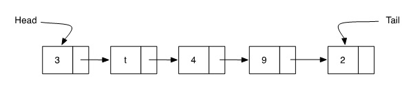
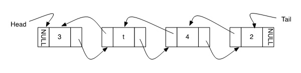
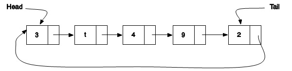

## Linked Lists

A linked list can be constructed in several different ways.The differences between the construction is in the number and purpose of the pointers in the node structure. Sometimes all that is needed is a simple list, where the first item in the list leads to the second item which leads to the third item and so on. This is called a **singly linked list**. A singly linked list provides no mechanism to return to the previous item. Imagine a collaborative story-writing task where each person writes a sentence on paper and then passes the paper to someone else who writes another sentence on the paper. At the end of the task, there is a story on each piece of paper and the last author is holding the list of sentences, but there is no record of who the previous authors were. That is how a singly linked list works. 
A **double linked list** provides a mechanism to identify both the next item on the list as well as the previous item on the list from any position in the list. A double linked list is similar to a group of people standing in line. Any individual person can identify both the person ahead of them in the line and the person behind them.

A **circular linked list** is a list of a fixed size. The last element of the circular list is connected to the first element of the list so that from the last element the program can easily return to the first element. A circular linked list doesn't really have an end point.

The next three images show a singly linked list, a double linked list and a circular linked list

{#fig:single width="50%"}

{#fig:double
width="50%"}

{#fig:circular
width="50%"}

### Implementation Details

When you write the operations for a linked list, the most challenging aspect is to keep track of the pointers that give access to the adjacent nodes in the list.

The pseudocode below illustrates the process for adding an element to the beginning of the list. This pseudocode assumes that currentElement is the beginning of the list and that newElement has already been allocated and is pointing to the list data. The order of these two lines of code is very important. Can you explain why?

           newElement-$>$next = currentElement-$>$next     
           currentElement-$>$next = newElement

The following steps are required to add a node to the end of the list:
 1.  Initialize a new element with the desired data. This should be a     separate function call. 
2.  Walk through until end of list is reached 
3.  Set the *next* attribute of the element at the end of the list to     the new element. 
The most challenging part of this algorithm is Step 2, walking through the list. This is an operation that you will find yourself doing frequently with linked data structures. The pseudocode for that step is shown below. Draw a list on some paper and work through the algorithm until you understand how to walk through a list to get to the end of the list.

    currentElement = firstElementOfList //usually called the head of the list
    while(currentElement->next is not NULL)
        currentElement = currentElement->next
    lastElement = currentElement

### Nodes

A node, or element, is the fundamental structure within a list.
Regardless of your choice of implementation for a list, you will need some kind of a node structure to contain the data for the list.

When we take the time to create an ADT, we want it to be truly abstract. That means that the ADT should not be tied to a particular kind of data, since the operations on a list are identical whether it is storing integers, strings, or structs. It is a waste of time and testing to create separate ADT libraries for every possible type of data.

Instead we abstract the data by creating a data structure called a **node**. As a minimum, the node contains a pointer that points to the data being stored, and a pointer to the next node in the list.

    typedef struct Node {
        void * data;
        struct Node * next;
    }Node;

The type of the data doesn't matter because it is cast to a void pointer (void \*). The data stored in the list might be a string; it might be an integer; or it might be a complex struct that represents a larger data record about some entity.

A linked list ADT should have a function that creates a new node, sets the next pointer to NULL, and assigns the data to the data pointer. Algorithms for working with linked lists assume that the **next pointer** for the tail element is set to NULL so that the end of the list is easily identified. It is very important to ensure that all new nodes have their next pointer initialized to NULL.

The data stored in a linked list is separate from the node definition. A node simply points to the data element. Suppose you were storing addresses in the list. The data representation would then contain elements for name, phone number, mailing address and possibly email address. A struct to represent the data might be given as follows.

    typedef struct Address {
        char * name;
        char * telephone;
        char * mailingAddress;
        char * email;
    } Address;

### Operations

A list ADT typically provides functions that add elements to the list, remove elements from the list, report how long the list is, and possibly sort the list. It also must provide functions to create and destroy the list.

A minimum set of operations is shown below. The names of the functions can vary, but an operation with comparable functionality is necessary. The parameters given in the pseudcode are also a minimum set of parameters. Implemented functions may need additional parameters.

    ·create(...): List
    ·destroy(List)
    ·insertFront(List,  DataElement):theHead
    ·getFront(List):DataElement
    ·deleteFront(List)

Once a list is created, it is manipulated through operations on the ADT functions. These functions and procedures can do whatever the programmer desires, as long as they are written carefully to **encapsulate** the implementation details of the list. While a list ADT is functional with just the minimum set of functions, usually more functions are provided with an ADT. Some common additional operations on lists include 
-   Finding the length of a list
     -   returns an int and takes the root of the list as a parameter
     -   getLength(List):int
 -   Finding an element of a list
     -   returns a pointer to the element in the list, without removing
        the element from the list 
    -   needs a search criteria and the list as parameters, and returns         a pointer to the data element, not the node 
    -   find(Element, List) 
-   Printing a list. 
    -   might print the entire list to stdout 
    -   a more elegant version returns a string (or pointer to a string)         that represents a nicely formatted printout of the list         elements. 
    -   print(List):char\* 
-   Adding/removing Nodes at the end of the list 
-   Adding/removing nodes after or before a specific element 
-   Adding/removing nodes in a specific position in the list 
-   getting the length of the list

-   **Iterator** operations (current, next, previous, head, tail)

    An iterator is a function that allows the user to step through the     elements in a data structure. Iterators typically "remember" the     current position so that the user can move backwards and forwards     within the data structure.

### Adding Elements

Elements can be added into a list at the beginning, in the middle, at some arbitrary location, at the end, etc. Each insert algorithm is slightly different than the others but the basic idea is the same in all cases.

1.  Construct a new list element 
2.  Put the desired data into the new element 
3.  Find the location where the element is supposed to be inserted 
4.  Adjust the other list elements so that the new one is in the right     location and so all existing elements are still part of the list 
Algorithms for inserting an element in the first position and last position are shown below. The pseudocode or algorithm for inserting in a specific location is left as an exercise for you to do.

    insertFirst(List, Element):theHead
    Also Known as:addFront, insertFront, addHead, etc
    Purpose: To add an element to the list at the front of the list
    Preconditions: An initialized list is available.  
    PostConditions: The node containing the desired data is added to the front of the list, the length of the list is increased by one, the head of the list is set to point at the newly added element.

    insertFirst(List, Element):theHead
         initialize a new node with the desired data
         set the next pointer of the new node to point at the first nod of the list
         set theHead  of the list to point at  the new node

    insertLast(List, DataElement):void
    Also Known as: addBack, insertBack, addTail, etc
    Purpose: To add an element to the list at the tail of the list
    Preconditions: An initialized list is available.  The new node has the next pointer initialized to NULL
    PostConditions: The node containing the desired data is added to the end of the list, the length of the list is increased by one.

    insertLast(List, DataElement):void
        initialize a new element with the desired data.  
        walk through until end of list is reached 
        set the next attribute of the element at the end of the list to the new element.    

### Deleting Nodes

Deleting nodes in a list uses algorithms that are the reverse of adding nodes. Nodes can be deleted from the front, the back, or any location in the list. The simplest algorithms delete nodes from the front or the back of the list.

    deleteFront(List):Element  //often a delete method returns the value it has deleted
    Also Known As: deleteFirst, removeFront, removeFirst
    Purpose: To remove the first element from the list and return it to the calling procedure
    Preconditions: A non-empty list is available
    PostConditions: The first element of the list is removed, the length of the list is decreased by one,  the removed element is returned.

    deleteFirst(List):Element
        set a temporary pointer(temp) to point at the first node in the list
       set the head pointer of the list to point at the second node in the list
       set the next pointer of the temporary node (the former first node)  to be NULL
        return(temp->data)

    deleteFromBack(List):Element  //often a delete method returns the value it has deleted
    Also Known As: deleteLast, removeBack,  etc
    Purpose: To remove the last element from the list and return it to the calling procedure
    Preconditions: A non-empty list is available
    PostConditions: The last element of the list is removed, the length of the list is decreased by one,  the removed element is returned.

    deleteLast(List):Element
        walk the list to find the second last element //node->next->next == NULL
        set a temporary pointer(temp) to point at the last node in the list
        set the next pointer of the second last element to NULL
       set the next pointer of the temporary node (the former last node)  to be NULL
        return(temp->data)

### Other Core List Operations

    isEmpty(List):Boolean
    Purpose: To determine if the list has any elements stored in it   
    Preconditions: An initialized list is available
    PostConditions: None

    isEmpty(List):Boolean
        if theHead == NULL and theTail == NULL
        then return (true)
        else return (false)

isFull() is a function that is only useful in situations where a list could be full. This might happen in situations where a specific amount of memory has been allocated to the list. In that case when the memory is full, a reallocation must be effected before the list size can be increased by adding another element.

    isFull():Boolean
    Purpose:To determine if the list is filled to capacity
    Preconditions: An initialized, non-empty list is available
    PostConditions: None
       
    isFull():Boolean
        if length == maxSize
        then return (true)
        else return (false)

    create(...): List
    Purpose: Create a new List initialized to be empty
    Inputs: the function pointers for functions to manage the data stored in the list
    Preconditions: None
    PostConditions: A new list is created and is empty

    create(...):List
        create the struct to hold the list metadata (head, tail, function pointers, etc)
        assign NULL to head (and tail if necessary)
        assign function pointers
        return(List)

    destroy(List)
    Purpose: To destroy a list, freeing memory if required
    Preconditions: A list exists
    PostConditions: The list is destroyed

    destroy(List)
       for each node in the list
           delete the data in the node using function pointer
           delete the node
       delete the struct holding the list metadata

## Array implementation for a list

The previous sections of this document have focussed on the list composed of linked data structures (the linked list). A list ADT does not have to be a constructed using linked nodes. An array can be used to construct a List ADT. At its simplest, the array holds the data in the list and each location in the array is one element of the list. The head of the list is at the first position in the array and the tail of the list is wherever the last element is.

The array-based list stores void \* data in the array in the same way that the linked node stored void \* data for the linked data structure. 
The choice of implementation does not change the operations required for the list ADT but it does change some of the implementation details. For example, if the user wished to insert data into the list maintaining a sorted order, the insert operation would require that room is made for the new element by shifting any subsequent elements one position in the array. If a data value was to be deleted from the list, the delete operation must ensure that the space left from the deletion is filled by shifting the tail-end of the array one space towards the head.

Because arrays must be allocated to be a fixed size in C, a new longer array must be constructed and the data copied into it if the list grows longer than the size of the array.

Fortunately, because of information hiding and encapsulation, the user of the the List ADT should never need to know whether the List is implemented as a linked data structure or an array-based list. 
##  Array Lists vs Linked Lists

**Linked Lists**

-   Advantages
     -   Linked lists can be an arbitrary size because the list grows and         shrinks as elements are added. 
    -   Insertion and deletion of data do not require moving other data         elements, so the operations are more efficient than the         comparable operation on an array structure. 
-   Disadvantages
     -   Linked lists are less efficient in situations where the program         must be able to access any element of the data at any point in         the program. This type of accessibility is called **random         access** and is more efficiently implemented with an array.

**Array Lists**

-   Advantages 
    -   Many operations are very fast because the array indices provide         direct access 
    -   functions are simple and easy to debug, making ADT development         simpler

-   Disadvantages
     -   The resizing operations can be processor intensive if the list         is large. There are many different strategies for deciding how         much bigger to make the new array when resizing.
     -   To keep an array sorted, you must shuffle the elements each time         you add another element.

## List Iterator

An iterator is a mechanism that allows navigation of a data structure. An iterator is usually a different structure (or class in the case of object oriented programs) that is fairly tightly coupled with the implementation of the data structure being iterated.

When creating an ADT library in C, iterator functions can be included easily either with, or without the use of additional structures.

List iterator methods permit forwards and backwards navigation of the list. They are extremely useful for accomplishing insertions and deletions because the navigation code is encapsulated within the iterator operation.

Iterator methods for a list might include: 
-   next() 
-   previous() 
-   first() 
-   last() 
-   moveToNth() 
-   getCurrentElement() 
-   setCurrentElement() 
While some of the iterator methods might seem to be duplicates of the basic list functions, an iterator has an important role to play in encapsulation. An iterator can hide the implementation of the list from the user of the library and can provide only the navigational functions to the user.

For example, an iterator for a list could be set up as follows:

    typedef struct Iterator
    {
        List * theList;
        Node * currentListPos;

    }ListIterator;

Given this structure, the functions shown above could take a ListIterator as a parameter and provide the user with data that is stored in the list. Of course, the ListIterator would need to be initialized with enough parameters that it could, in turn, initialize the underlying list.

An algorithm for the *next()* function is shown below.

    next(ListIterator):DataElement  
    Purpose: To move to the next element in a list and return the value of that element
    Preconditions: The List member of the ListIterator is non-empty
    PostConditions: The currentListPos of the iterator is increased by one and the data stored at that node is returned

    next(ListIterator):DataElement  
        if currentListPos is not the end of the list
           dataToReturn = currentListPos->data
           currentListPos = currentListPos->next
        return (dataToReturn)

Some list iterator operations, such as previous() are easier using a double linked list, but all operations are possible regardless of list implementation. The algorithm for other list iterator operations are left as a practice exercise.

